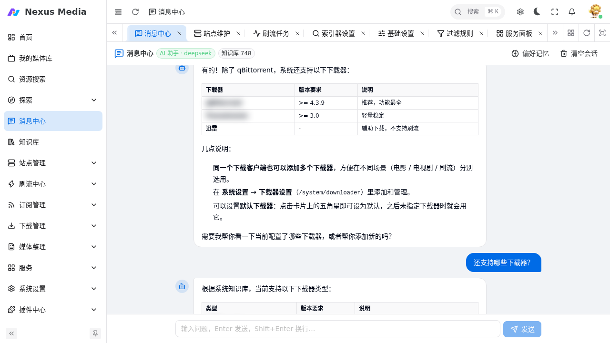
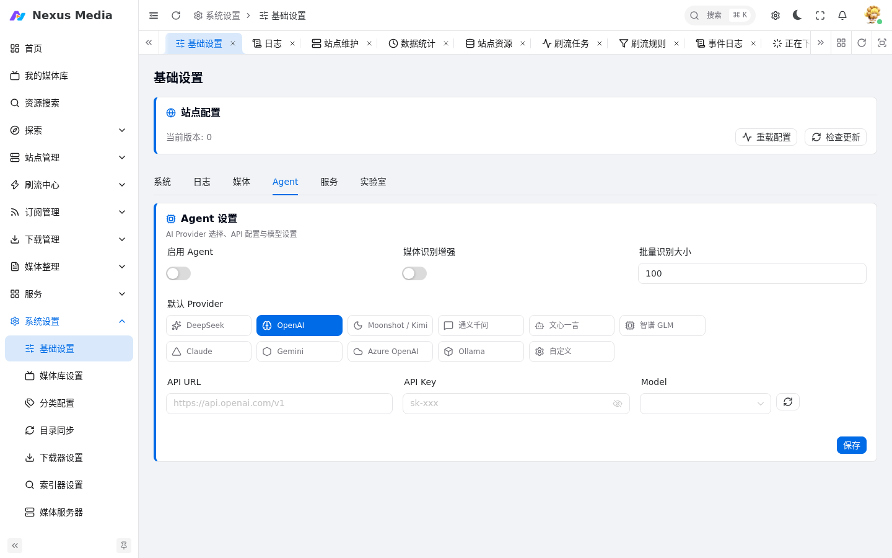

# AI 助手（消息中心）

Nexus Media 内置 AI 助手，可在**消息中心**（`/message-center`）以对话方式完成资源搜索、订阅管理、下载操作、知识库问答等任务。助手可以**调用系统工具**完成实际操作，并在对话中展示思考过程和工具调用步骤。

{ .screenshot }

## 快速开始

### 1. 配置 Agent Provider

在 **系统设置 → 基础设置 → Agent** 标签页中：

1. 打开「启用 Agent」开关
2. 选择 **默认 Provider**（支持 DeepSeek / OpenAI / Moonshot / 通义千问 / 文心一言 / 智谱 GLM / Claude / Gemini / Azure OpenAI / Ollama / 自定义等）
3. 填写 **API URL**、**API Key**、**Model**
4. （可选）勾选 **故障转移链**：主 Provider 失败时依次切换
5. 点击保存

{ .screenshot }

!!! note
    无需配置 API Key 的 Ollama / 本地模型仅需 API URL 与 Model，例如 `http://localhost:11434` + `qwen2.5:32b`。

### 2. 配置 Embedding（知识库问答）

知识库用于回答项目相关的问题（下载器、站点、刷流、媒体整理等）。默认用**关键词检索**即可工作；配置 Embedding 后支持**向量语义检索**，回答更准确。

- **Embedding Provider**：选择与对话相同或独立的服务
- **Embedding Model**：例如 `qwen3-text-embedding`、`bge-m3`、`nomic-embed-text`
- **Embedding API URL / Key**（可选）：留空则继承 Provider 的连接参数

配置后进入 **知识库**（`/kb`）页面点击「重建索引」，将系统内置文档向量化。索引规模在消息中心左上角可见（如「知识库 748」）。

!!! warning "关于 Embedding 模型"
    对话模型（如 `qwen2.5:0.8b` 等聊天模型）**不能**作为 Embedding 模型使用。请选择专门的 Embedding 模型（如 `nomic-embed-text`、`bge-m3`、`text-embedding-3-small`），否则知识库检索将失败或质量极差。

### 3. 开始对话

打开 **消息中心**（侧边栏「消息中心」或 `/message-center`），在底部输入框提问即可。

## 消息中心使用

### 思考过程

助手执行任务时会展示「思考过程」面板，包含：

- **推理文本**：模型生成回答前的思考内容（实时流式显示，可折叠）
- **工具步骤**：每一步工具调用及其执行结果（成功/失败）

{ .screenshot }

- 面板在思考/调用开始时**自动展开**，可随时点击「思考过程」按钮折叠
- 工具执行中步骤显示旋转图标，完成后显示成功/失败状态
- 多次调用同一工具（如多次知识库检索）会按步骤依次列出，结果不会串位

### 输入技巧

- **回车发送**，`Shift + Enter` 换行
- 中文输入法下按回车**确认候选词不会误发消息**
- 对话上下文默认保留在会话中，可点击「清空会话」开始新话题

### 确认与危险操作

下载、删除订阅/种子、修改配置等写入类操作（dangerous 或需确认的 write 工具）执行前会弹出**确认卡片**展示工具与参数，在 **Web 端**确认后才真正执行（`/api/agent/chat/confirm`）。
注意：IM/消息渠道（飞书、Telegram、微信等）不支持确认卡，触发此类操作会返回“需要二次确认”的提示，请到 Web 端 Agent 对话中确认执行。

## 能力清单

助手可调用的系统工具（会随版本演进，实际以会话中展示为准）：

### 媒体与搜索

| 工具 | 说明 |
|------|------|
| `media_search` | 按关键词搜索影视资源（可指定站点、最低做种数） |
| `media_detail` | 查询影视详情（TMDB 元数据） |
| `library_check` | 查询媒体库中是否已有指定媒体 |

### 下载管理

| 工具 | 说明 |
|------|------|
| `media_download` | 搜索并择优下载影视资源 |
| `download_add_link` | 添加磁力/种子链接下载 |
| `download_list` | 查看下载任务列表 |
| `download_control` | 暂停/开始/删除下载任务 |
| `downloader_status` | 查询下载器状态与配额 |

### 订阅管理

| 工具 | 说明 |
|------|------|
| `subscribe_add` | 新增电影/电视剧订阅 |
| `subscribe_list` | 查看订阅列表 |
| `subscribe_delete` | 删除订阅 |

### 知识库与运维

| 工具 | 说明 |
|------|------|
| `kb_search` | 检索系统知识库 |
| `system_status` | 查询系统运行状态 |
| `scheduler_list` / `scheduler_run` | 查看/运行后台任务 |
| `transfer_run` | 手动触发文件转移 |
| `browser_fetch` / `browser_screenshot` | 浏览器抓取网页 / 截图（需启用网页自动化与 nexus-chrome） |

> 实际注册工具约 **65 个**，除上表外还含：配置读写（`config_set` / `config_apply_manifest`）、下载器/索引器/刮削配置保存、消息客户端、插件管理、识别词管理、站点 Cookie 更新、会话记忆（`memory_clear` / `memory_forget`）、存储/媒体库同步等。完整清单以代码注册为准（`src/app/agent/tools/catalog.py`），会话中也可直接向助手询问支持的工具。
>
> **插件工具**：插件可在 manifest `backend.tools` 声明自己的 Agent 工具（name/description/parameters/level/permission），启用后在 `backend.agent_tool(name, arguments)` 实现逻辑即可，由 ToolExecutor 动态合并进会话；写/危险分级、RBAC 与 Web 确认流与内置工具一致。集成步骤见 [docs/agent-plugin-tools.md](agent-plugin-tools.md)。

## 知识库

知识库（`/kb`）按命名空间组织，内置了下载器、站点、刷流、媒体整理、FAQ 等操作文档。可在知识库页面查看内容、触发重建索引。

- **命名空间**：`media_library`、`messages`、`faq`、`operations` 等
- **检索方式**：未配置 Embedding 时使用关键词检索；配置后使用向量语义检索
- **偏好记忆**：启用长程语义记忆后，助手会记住用户偏好并在后续对话中自动注入

## 配置详解（config.yaml）

消息中心的全部能力由 `config.yaml` 的 `agent:` 节点配置：

```yaml
agent:
  enabled: false            # 是否启用
  default_provider: ollama  # 默认对话 Provider
  fallback: []              # 故障转移链（主 Provider 失败时依次尝试）
  providers:
    ollama:
      api_url: http://localhost:11434
      model: qwen2.5:32b
    openai:
      api_key:
      api_url:
      model: gpt-4o
  embedding:                # 知识库向量化（api_key/api_url 留空继承 Provider）
    provider: ollama
    model: nomic-embed-text
  vector_store: sqlite      # sqlite（默认） | lancedb（需 AVX2）
  rag:
    chunk_size: 800         # 切块大小
    chunk_overlap: 100
    top_k: 6                # 检索返回条数
    rerank_top_k: 3
    namespaces: [media_library, messages, faq, operations]
  memory:
    max_steps: 8            # 单轮工具循环步数上限（对应模型请求次数上限 max_steps+1）
    short_term:
      store: db
      max_tokens: 4000      # 会话 token 预算，超出触发滚动摘要
      ttl_days: 30
    long_term:              # 长程语义记忆（用户偏好/事实）
      enabled: false
      top_k: 5
      extraction: on_session_end
  reasoning_effort: high     # 推理强度：low | high | max
  disable_thinking: false    # true=关闭思考模式（thinking disabled）
  notify:                   # 通知增强：LLM 重写模板通知
    enabled: false
    msg_types: [download_start, download_fail, rss_finished, transfer_finished, transfer_fail, site_signin]
    temperature: 0.3
```

## 常见问题

**知识库搜索无结果或效果差**

1. 确认已配置 Embedding 并重建索引（知识库页面「重建索引」）
2. 确认 Embedding 模型是专门的向量模型而非对话模型
3. 检查向量库路径可写（`vector_store: sqlite` 默认在数据目录）

**助手回答与系统状态不符**

1. 确认知识库已包含最新内置文档（升级后重新「重建索引」）
2. 涉及实时数据的问题（下载进度、磁盘空间等）助手会调用工具获取，若工具失败请检查下载器/站点连通性

**助手无法调用工具**

- 确认「启用 Agent」已打开
- 工具所需的站点、下载器、浏览器（nexus-chrome）组件需先配置好
- 危险操作需要确认卡片，确认后才执行
