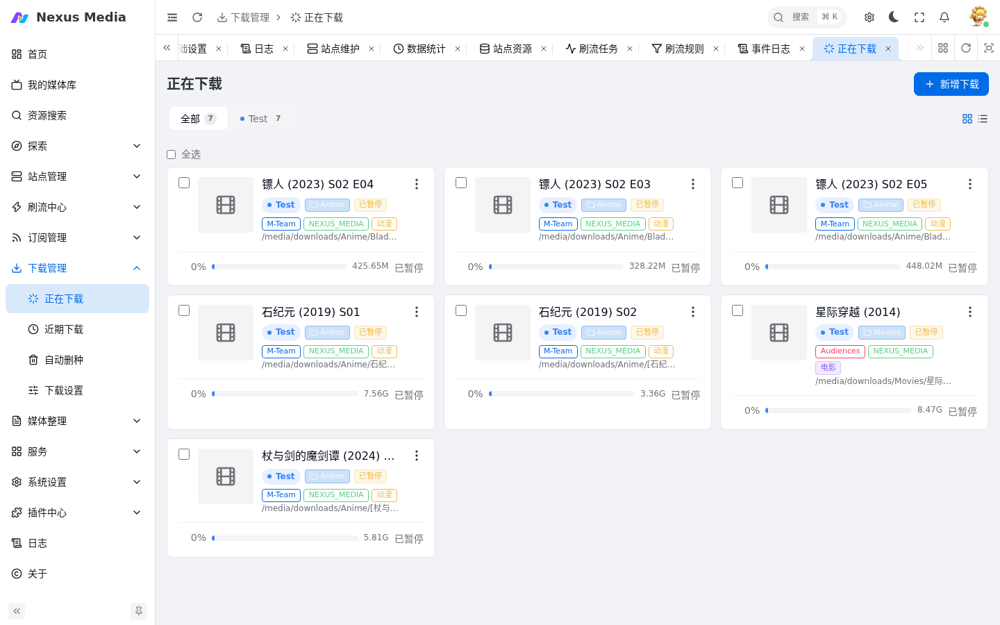
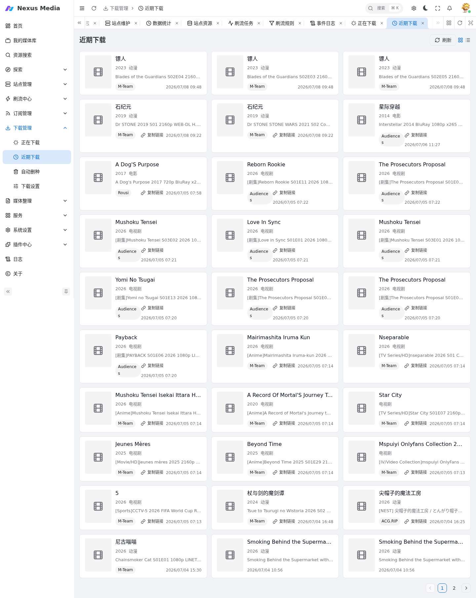
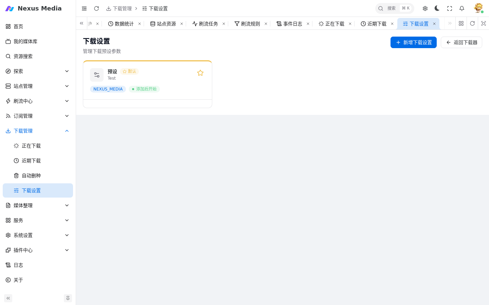
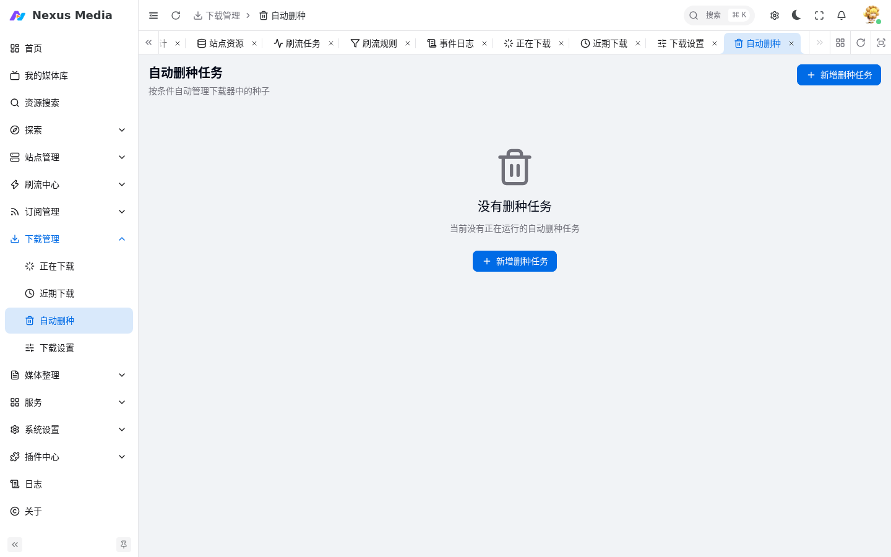

# 下载管理

下载管理菜单一览下载器中的任务和下载记录，包含：正在下载、下载历史、下载设置、自动删种。下载器本身的连接配置见 [下载器配置](downloaders.md)。

## 正在下载

入口：**下载管理 → 正在下载**（`/download/downloading`）。实时查看下载器中的活动任务。

{ .screenshot }

- 实时显示进度、速度和剩余时间
- 支持暂停 / 开始 / 删除操作
- 点击任务可查看种子详情

## 下载历史

入口：**下载管理 → 下载历史**（`/download/history`）。

{ .screenshot }

- 按时间倒序展示已完成的下载记录
- 显示识别结果和文件转移状态
- 识别或转移失败的记录可重新处理

## 下载设置

入口：**下载管理 → 下载设置**（`/download/settings`）。预设下载参数模板，适用于常规下载任务（刷流任务除外）。

{ .screenshot }

| 参数 | 说明 |
|------|------|
| 分类 | QB 分类标签 |
| 标签 | 自动添加的标签，所有任务自动附加 `NEXUS_MEDIA` 标签 |
| 上传限速 / 下载限速 | 单位 KB/s |
| 分享率限制 | 达到后自动停止做种 |
| 做种时间限制 | 单位小时 |
| 下载器 | 指定该模板使用的下载器 |

**默认设置**：系统预设不可修改，点击五角星将某套设置设为默认，未指定时自动使用默认设置。

## 自动删种

入口：**下载管理 → 自动删种**（`/download/torrent-remove`）。配置规则自动清理下载器中的种子。

{ .screenshot }

### 删种条件

| 条件 | 说明 |
|------|------|
| 做种时间 | 超过设定小时数 |
| 分享率 | 超过设定值 |
| 上传量 | 超过设定 GB |
| 平均上传速度 | 低于设定 KB/s |
| 磁盘空间 | 剩余低于设定 GB |
| Free 到期 | 促销结束后删除 |

### 规则模式

- **或模式**：满足任一条件即删除
- **与模式**：满足全部条件才删除

规则可关联到具体下载器，对满足条件的种子执行删除。

!!! warning
    删种操作不可逆，请谨慎配置阈值。自动删种仅删除下载器中的任务和种子文件，已转移到媒体库的文件不受影响。建议在刷流场景使用，常规下载慎用。
