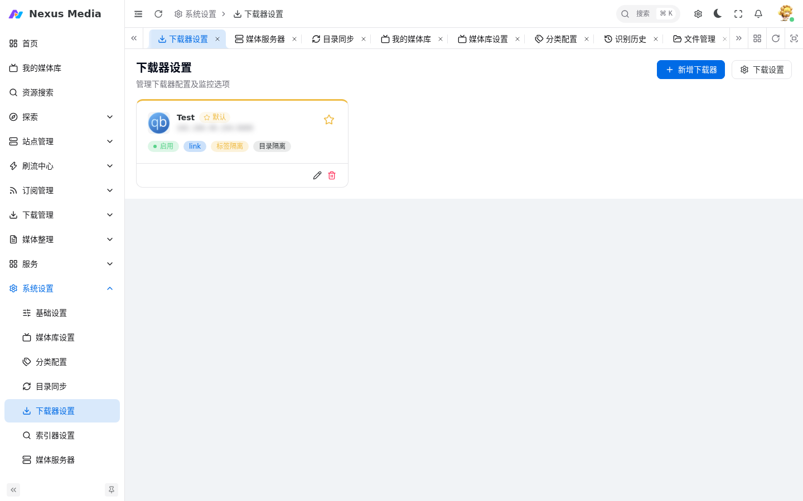

# 下载器配置

入口：**系统设置 → 下载器设置**（`/system/downloader`）。添加和管理下载客户端。

{ .screenshot }

## 支持的类型

| 类型 | 版本要求 | 说明 |
|------|----------|------|
| qBittorrent | >= 4.3.9 | 推荐，功能最全 |
| Transmission | >= 3.0 | 轻量稳定 |
| Aria2 | - | 轻量高效，支持监控与自动删种 |
| 迅雷 | - | 辅助下载，不支持刷流 |

支持同一个下载客户端添加为多个下载器，在不同场景（电影/电视剧/刷流）分别选择使用。**默认下载器**：点击卡片上的五角星设为默认，未指定下载器时使用。

## 关键配置项

### 监控

- 下载完成后自动转移文件到媒体库
- 与 [目录同步](directory_sync.md) 功能二选一，不要同时开启

### 转移方式

参考 [转移方式详解](directory_sync.md#转移方式详解)。

### 标签隔离

- 启用：仅处理含 `NEXUS_MEDIA` 标签的任务
- 关闭：处理所有下载任务

### 目录隔离

- 启用：仅处理指定目录范围内的任务
- 关闭：处理所有目录的任务

### 下载目录

按媒体类型（电影/电视剧/动漫）分别配置保存路径。

## QB 种子管理模式

- **默认模式**：使用 qBittorrent 客户端原有设置，Nexus Media 不做修改
- **手动模式**：强制开启手动管理模式，下载目录由 Nexus Media 直接指定
- **自动模式**：强制开启自动管理模式，下载目录由分类标签决定，无标签时使用默认保存路径

!!! warning
    自动模式下 Nexus Media 会创建对应分类，已有分类的保存路径将被覆盖。

## Aria2 配置

| 参数 | 必填 | 说明 | 默认值 |
|------|------|------|--------|
| IP地址 | 是 | Aria2 服务地址，HTTPS 需加 `https://` 前缀 | - |
| 端口 | 是 | Aria2 JSON-RPC 端口 | 6800 |
| 令牌 | 是 | RPC 密钥（`--rpc-secret`） | - |

支持监控下载完成转移、自动删种、速度限制等能力，可配合刷流任务使用。

## 迅雷配置

| 参数 | 必填 | 说明 | 默认值 |
|------|------|------|--------|
| IP地址 | 是 | 迅雷 NAS 设备的 IP 地址 | - |
| 端口 | 是 | 迅雷 NAS Web 管理端口 | 2345 |
| 认证令牌 | 否 | Basic 认证令牌 | - |

**认证令牌获取**：

1. 登录迅雷 NAS Web 管理界面
2. 使用浏览器开发者工具（F12）查看网络请求
3. 在请求头中找到 `Authorization` 字段
4. 复制 `Basic base64(username:password)` 格式的值

**功能限制**：不支持速度限制、标签管理、自动删种、种子重新校验、获取磁盘剩余空间。支持添加任务、查看进度、暂停/开始、删除、下载完成监控。

!!! note
    迅雷适合作为辅助下载器，不建议用于刷流任务。
