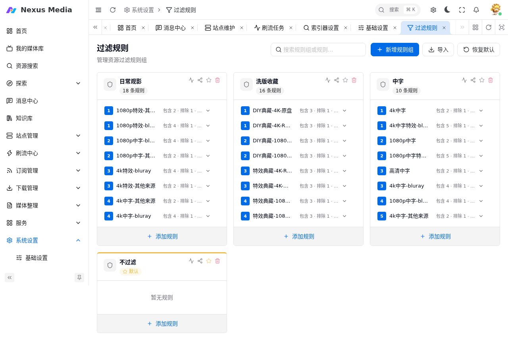

# 过滤规则

过滤规则用于**筛选符合质量要求的资源**，在站点搜索、订阅下载、刷流选种时按规则组匹配。入口：**系统设置 → 过滤规则**（`/system/filter`）。

{ .screenshot }

## 规则组与规则

过滤规则以**规则组**为组织单位，一个规则组内包含多条按优先级排列的规则：

| 概念 | 说明 |
|------|------|
| 规则组 | 一组筛选条件的集合，可被站点、订阅引用（如「日常观影」「洗版收藏」） |
| 规则 | 组内按优先级（1 为最高）逐条匹配的筛选条件，命中即选用该规则 |
| 优先级 | 数字越小越优先，资源匹配到的优先级越高，排序与择优时权重越大 |

## 单条规则的条件

| 条件 | 说明 |
|------|------|
| 包含 | 命中任一关键词（支持正则）才通过，逐行填写 |
| 排除 | 命中任一关键词（支持正则）即拒绝，逐行填写 |
| 大小 | 可选：不小于 / 不大于 / 区间（GB），留空不限制 |
| 促销 | 可选：仅匹配 FREE 等促销类型（`note`） |
| 优先级 | 该规则在组内的优先级 |

!!! tip "使用正则"
    包含/排除支持正则表达式，如 `^.*4K.*$`。规则优先匹配「包含」，再过滤「排除」。

## 使用场景

- **站点**：新增站点时在「过滤规则」中选择规则组，该站点搜索/刷流时按组内规则筛选
- **订阅**：订阅默认设置与单条订阅中可选择过滤规则组
- **洗版**：同一资源多次入库时，按「已洗版优先级」决定是否用新版本替换旧版本

## 管理操作

- **新增规则组**：创建新的规则组并添加规则
- **导入**：从 JSON 文件导入规则组（与备份恢复同格式）
- **恢复默认**：恢复系统内置的默认规则组
- **添加规则**：在规则组内追加规则并设置优先级

## 与下载优先级的关系

资源命中的规则优先级（`res_order = 100 - pri`）参与 [下载择优](indexers.md#择优下载) 排序：**规则优先级高的资源优先选择**，其次才按做种数/站点顺序。

## 常见问题

**规则未生效**

1. 站点 / 订阅是否正确引用了该规则组
2. 检查规则的「包含」条件是否命中资源标题（含副标题）
3. 检查「排除」条件是否误命中
4. 确认规则组已启用（组内规则状态正常）
