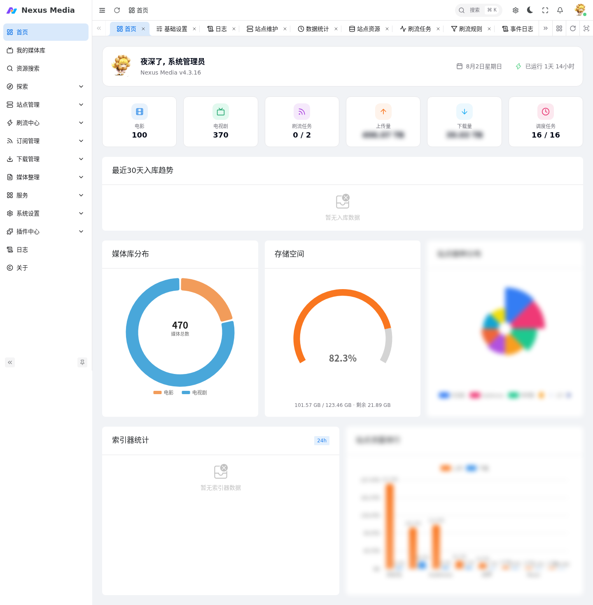

# Nexus Media

Nexus Media 是一个功能强大的媒体库管理工具，提供自动化追剧、资源下载、文件整理和订阅管理等功能，适合 PT 用户和影视爱好者使用。

{ .screenshot }

## 主要功能

- **自动下载**：支持多种 PT 站点资源自动下载
- **媒体管理**：自动识别和整理媒体文件
- **订阅系统**：RSS 自动订阅和手动订阅
- **刷流功能**：支持多种 PT 站点自动刷流
- **插件系统**：可扩展的功能插件

## 界面一览

| 功能 | 入口 | 文档 |
|------|------|------|
| 首页仪表盘 | `/dashboard/home` | - |
| AI 助手 | `/message-center` | [AI 助手](agent.md) |
| 消息通知 | 右上角铃铛 | [通知渠道配置](notifications.md) · [浏览器系统通知（PWA/Web Push）](webpush.md) |
| 知识库 | `/kb` | [AI 助手](agent.md) |
| 我的媒体库 | `/library` | [媒体库](media_library.md) |
| 资源搜索 | `/media/search` | [资源搜索与探索](search.md) |
| 探索推荐 | `/discovery/recommend` | [资源搜索与探索](search.md) |
| 站点管理 | `/site/list` | [站点配置](sites.md) |
| 订阅管理 | `/subscription/movie` | [RSS 订阅](rss.md) |
| 下载管理 | `/download/downloading` | [下载管理](download_management.md) |
| 媒体整理 | `/rename/history` | [媒体整理](media_organization.md) |
| 服务 | `/service/panel` | [服务与调度](service.md) |
| 系统设置 | `/system/basic` | [基础配置](configuration.md) |
| 插件中心 | `/plugin/market` | [插件使用](plugins.md) |

## 快速开始

1. [安装部署](installation.md) — Docker / Docker Compose 一键部署
2. [基础配置](configuration.md) — 完成系统基础设置（TMDB Key、代理）
3. [站点配置](sites.md) — 添加第一个 PT 站点
4. [下载器配置](downloaders.md) — 连接 qBittorrent / Transmission
5. [RSS 订阅](rss.md) — 建立第一个订阅
6. [AI 助手](agent.md) — 用对话方式操作整个系统

## 支持与帮助

- 问题反馈：[GitHub Issues](https://github.com/linyuan0213/nexus-media/issues)
- 交流群组：[Telegram 群组](https://t.me/+UxUIoJMmH2YwYWE1)
- 站点适配：[nexus-media-sites](https://github.com/linyuan0213/nexus-media-sites) 提 Issues
