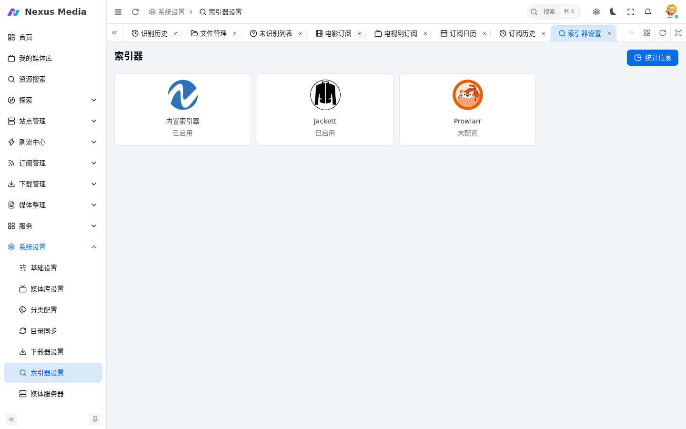

# 索引器配置

入口：**系统设置 → 索引器设置**（`/system/indexer`）。

{ .screenshot }

## 内建索引器

- 在 [站点维护](sites.md#站点维护) 中添加站点后，支持的内建索引器会自动显示
- **只有选中的站点才会在搜索中使用**
- 新站点适配需求请在 [nexus-media-sites 项目](https://github.com/linyuan0213/nexus-media-sites)提 Issues

## 外置索引器

### Jackett

- **服务器地址**：Jackett 服务 IP 和端口
- **API Key**：Jackett 控制面板中获取
- **密码**：Jackett 访问密码（如设置）

### Prowlarr

- **服务器地址**：Prowlarr 服务 IP 和端口
- **API Key**：Prowlarr 设置中获取
