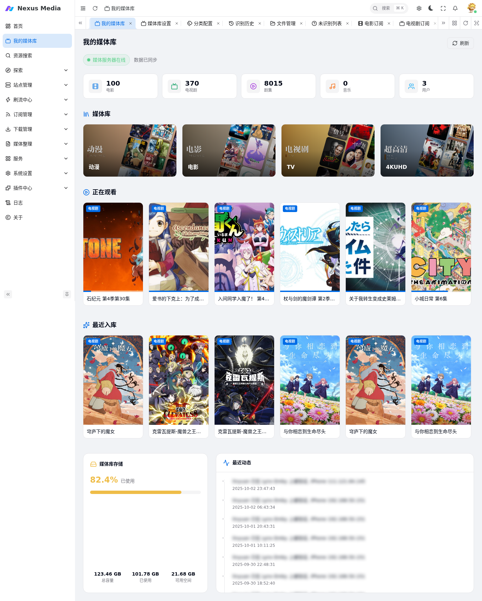
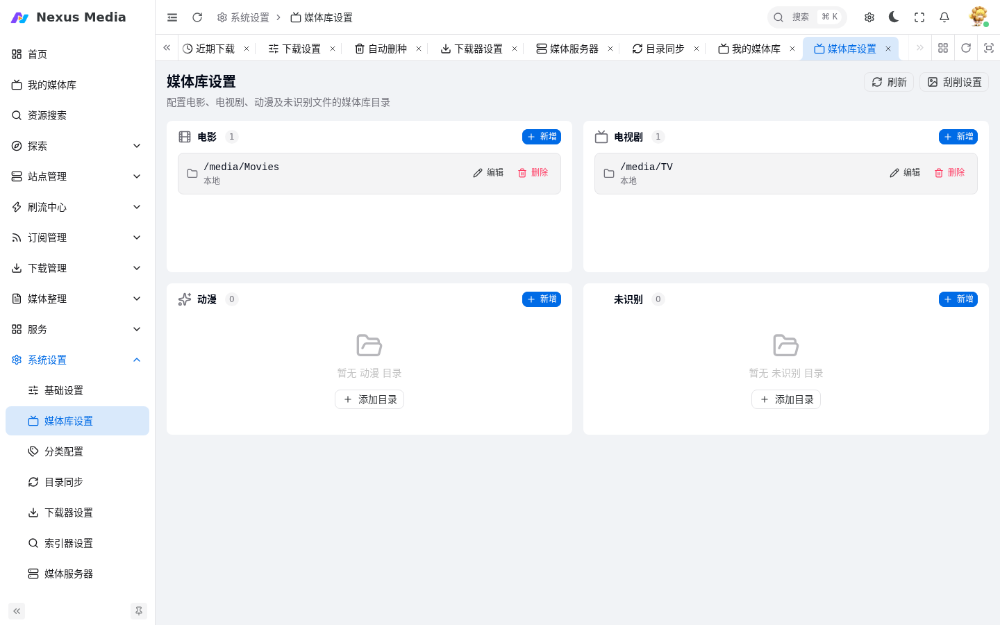
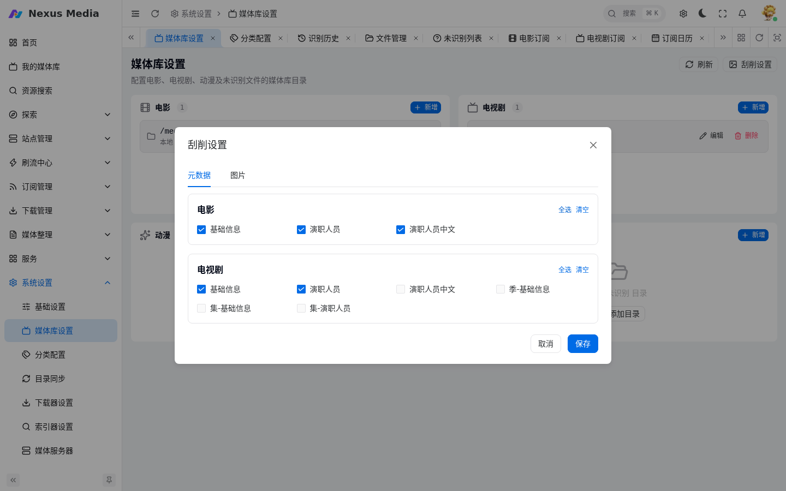
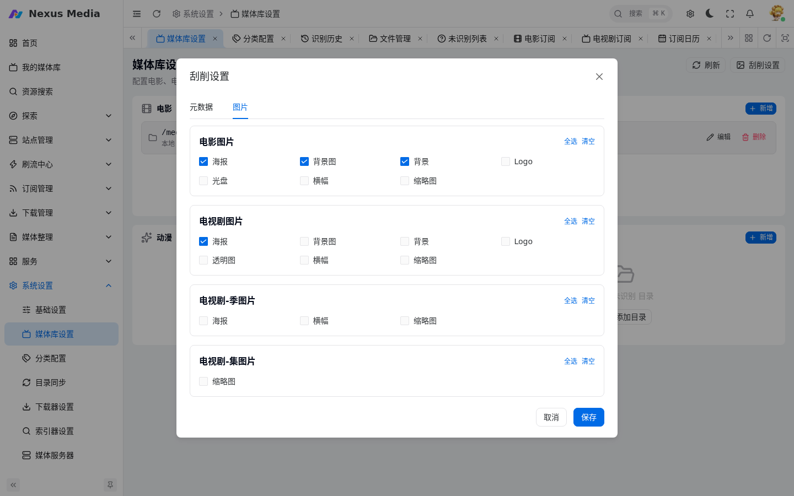
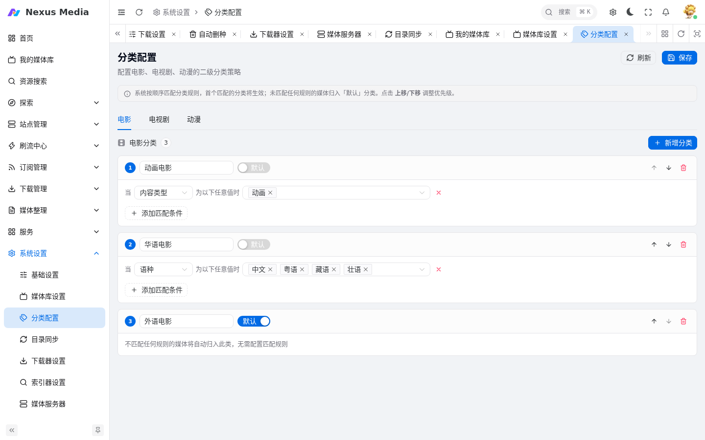

# 媒体库

媒体库分两部分：**我的媒体库**（`/library`，展示已入库媒体）和 **系统设置 → 媒体库设置**（`/system/library`，配置媒体库目录），二级分类策略在 **系统设置 → 分类配置**（`/system/category`）中维护。

## 我的媒体库

入口：**我的媒体库**（`/library`）。以海报墙形式展示已入库的电影、电视剧和动漫。

{ .screenshot }

## 媒体库设置

入口：**系统设置 → 媒体库设置**（`/system/library`）。配置各类型媒体的存放目录。

{ .screenshot }

**媒体库目录的作用**：

- 展示「我的媒体库」磁盘空间使用情况
- 作为「下载器监控」的默认转移目的目录
- 作为「目录同步」未指定目的目录时的默认转移目录
- 作为「媒体库刮削」等插件的刮削目录

**目录配置示例**：

```yaml
媒体库:
  电影:
    - /data/media/movies
  电视剧:
    - /data/media/tvshows
  动漫:
    - /data/media/anime
未识别目录: /data/media/unidentified  # 可选，建议留空
```

**未识别目录**：转移失败时原文件会转入此目录。该目录下的文件程序不会主动清理，建议不配置，未识别记录在 [文件管理](media_organization.md#文件管理)（`/rename/mediafile`）中处理。

## 刮削设置

入口：**系统设置 → 媒体库设置** 页面右上角「刮削设置」按钮。控制转移入库时生成哪些元数据（nfo）和图片，分「元数据」和「图片」两个标签页。刮削总开关在 [基础设置 → 媒体](configuration.md#媒体) 的「刮削元数据及图片」。

**元数据**（生成 nfo 文件）：

{ .screenshot }

| 分组 | 选项 | 说明 |
|------|------|------|
| 电影 | 基础信息 / 演职人员 / 演职人员中文 | 「演职人员中文」会频繁访问豆瓣，谨慎开启 |
| 电视剧 | 基础信息 / 演职人员 / 演职人员中文 | 剧集级 nfo |
| 电视剧 | 季-基础信息 | 每季一个 season.nfo |
| 电视剧 | 集-基础信息 / 集-演职人员 | 每集一个 nfo，文件量大 |

**图片**（生成海报等图片文件）：

{ .screenshot }

| 分组 | 选项 |
|------|------|
| 电影图片 | 海报 / 背景图 / 背景 / Logo / 光盘 / 横幅 / 缩略图 |
| 电视剧图片 | 海报 / 背景图 / 背景 / Logo / 透明图 / 横幅 / 缩略图 |
| 电视剧-季图片 | 海报 / 横幅 / 缩略图 |
| 电视剧-集图片 | 缩略图 |

!!! tip
    Emby/Jellyfin 自身也会刮削图片，全选会产生较多文件；一般保留「海报 + 背景图」即可。

## 分类配置

入口：**系统设置 → 分类配置**（`/system/category`）。

{ .screenshot }

### 一级分类（固定不可调整）

| 类型 | 说明 |
|------|------|
| 电影 | 所有电影内容 |
| 电视剧 | 所有剧集内容 |
| 动漫 | 仅动漫剧集 |

### 二级分类策略

通过条件自动归类，例如：

```yaml
movie:
  华语电影:
    original_language: 'zh,cn'
  外语电影:

tv:
  国产剧:
    origin_country: 'CN,TW,HK'
  欧美剧:
    origin_country: 'US,UK'
```

!!! tip
    避免对下载目录过度细分，交给二级分类策略自动整理。多分类目录需分别维护到对应一级分类下，通过 [目录同步](directory_sync.md) 维护转移关系。

## 多磁盘支持

工作流程：优先使用与原文件同磁盘的媒体库目录；无同磁盘目录时，按配置顺序查找第一个空间足够的目录。

```yaml
媒体库:
  电影:
    - /mnt/disk1/movies  # 磁盘1
    - /mnt/disk2/movies  # 磁盘2
  电视剧:
    - /mnt/nas/tvshows   # 网络存储
```
