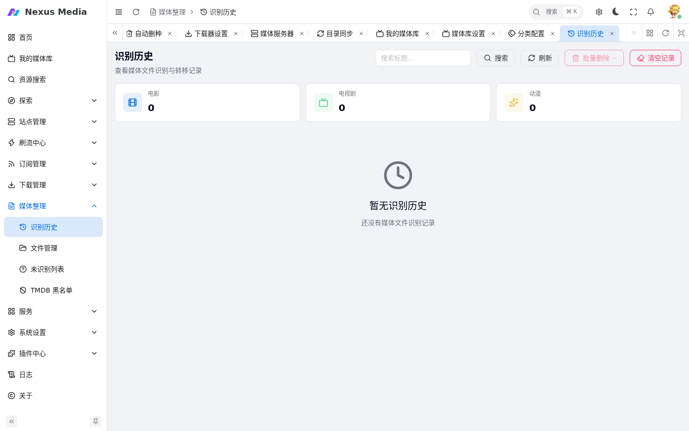
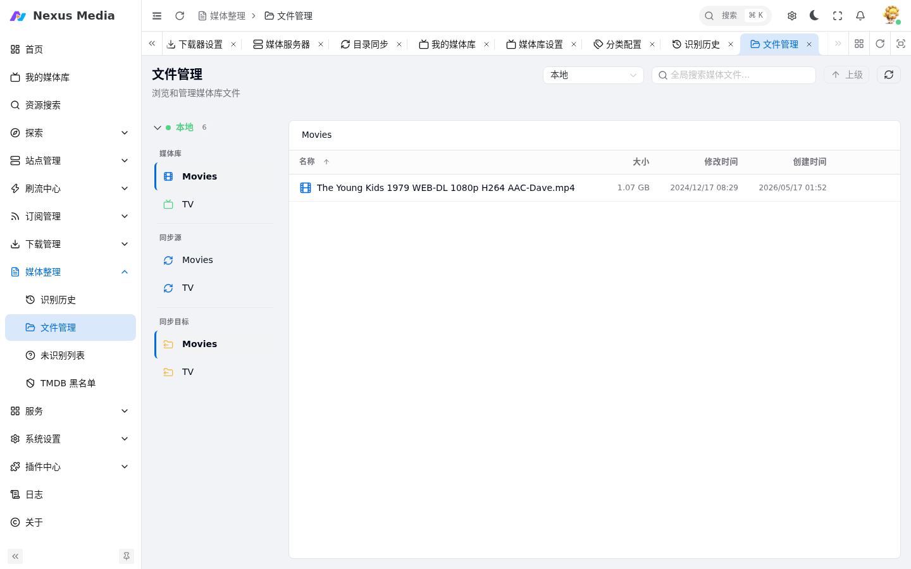
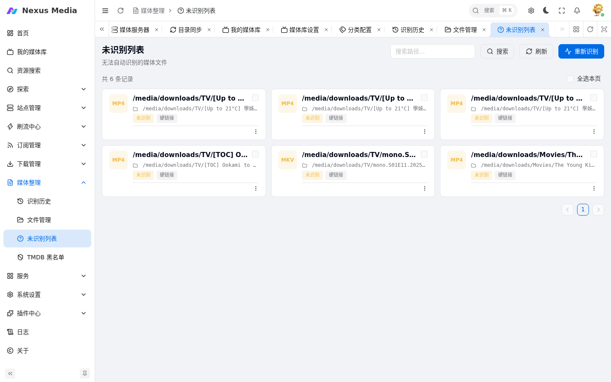

# 媒体整理

媒体整理菜单包含三个功能：识别历史、文件管理、未识别列表。

## 识别历史

入口：**媒体整理 → 识别历史**（`/rename/history`）。查看所有已完成的媒体识别和转移记录。

{ .screenshot }

- 显示源文件路径、识别结果、转移方式
- 支持按状态筛选（成功 / 失败）
- 失败的记录可点击重新识别

## 文件管理

入口：**媒体整理 → 文件管理**（`/rename/mediafile`）。手动浏览和管理媒体库文件。

{ .screenshot }

- 浏览媒体库目录结构
- 查看文件详情
- 手动触发识别和刮削
- 删除或转移文件

## 未识别列表

入口：**媒体整理 → 未识别列表**（`/rename/unidentification`）。自动转移过程中无法识别的文件会进入此列表。

{ .screenshot }

处理步骤：

1. 查看未识别文件列表
2. 点击文件进行手动识别：输入正确的 TMDB ID，或搜索媒体名称匹配
3. 确认后执行转移和重命名

## 手动识别操作

1. 选择正确的媒体类型（电影 / 电视剧）
2. 搜索或输入 TMDB ID
3. 选择匹配的季/集（电视剧）
4. 选择转移方式
5. 确认执行

## TMDB 黑名单

识别错误时，可将错误的 TMDB ID 加入黑名单（`/rename/blacklist`），避免再次误匹配。

## 识别相关设置

在 **系统设置 → 基础设置 → 媒体** 中配置：

- **默认文件转移方式**：硬链接 / 软链接 / 复制 / 移动
- **转移最小文件大小**：低于此值的文件不处理
- **高质量文件覆盖**：发现更高质量版本时自动替换
- **刮削元数据及图片**：生成 nfo 文件和媒体图片

详见 [基础配置](configuration.md#媒体)。
