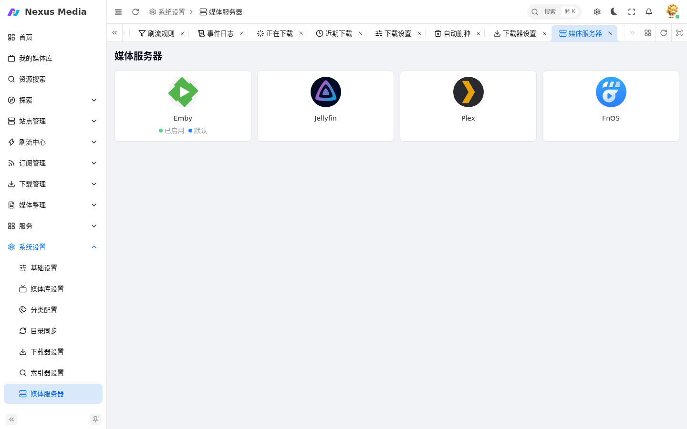

# 媒体服务器配置

入口：**系统设置 → 媒体服务器**（`/system/mediaserver`）。连接 Emby / Jellyfin / Plex / FnOS，实现媒体库状态同步、播放通知等功能。

{ .screenshot }

## 通用配置

- **服务器地址**：`IP:端口`，HTTPS 需加 `https://` 前缀
- **媒体播放地址**：留空则默认使用服务器地址

## Emby

- **API Key**：在 `Emby 设置 → 高级 → API 密钥` 处生成
- 仅复制密钥部分，不要复制应用名称

## Jellyfin

- **API Key**：在 `Jellyfin 设置 → 高级 → API 密钥` 处生成
- 其他配置与 Emby 相同

## Plex

推荐使用 X-Plex-Token 方式连接，速度更快。

- **X-Plex-Token**：通过浏览器 F12 → 网络，从请求 URL 中获取
- **备选方式**：服务器名称 + 用户名密码。服务器名称在 Plex 设置左侧下拉框中显示

## FnOS（飞牛媒体库）

- **用户名 / 密码**：媒体库登录账号密码

## Webhook 功能

- **播放状态通知**：实时获取播放信息
- **外网播放限速**：检测到外网播放时自动限速
- **电影精选**：标记精选内容
- **联动删除**：媒体库删除时同步操作
