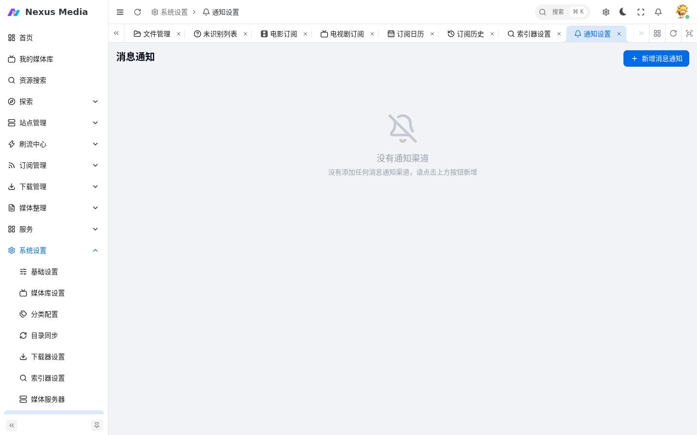
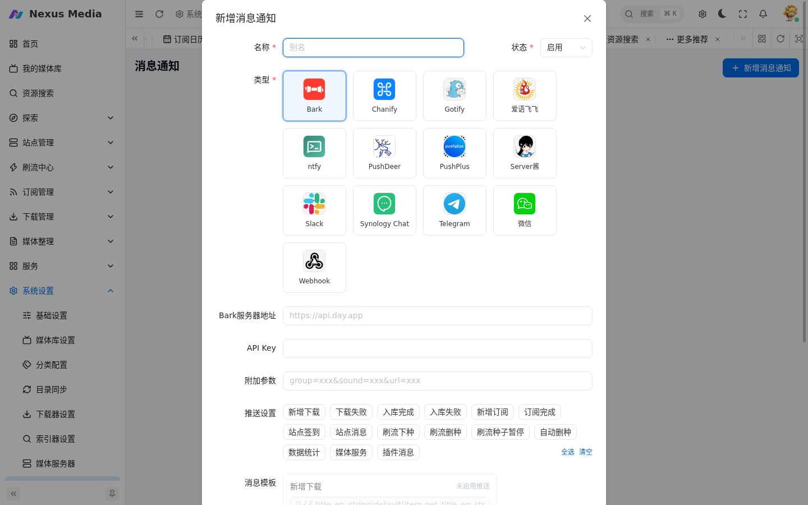
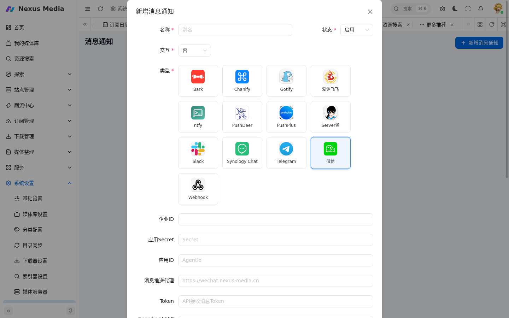
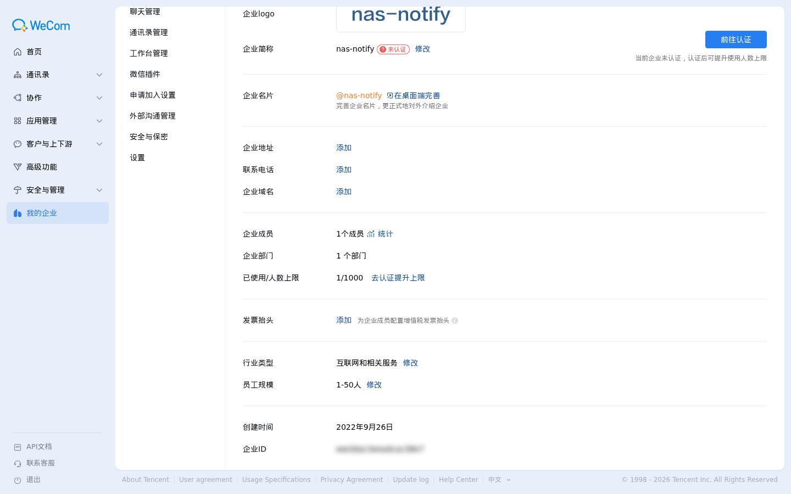
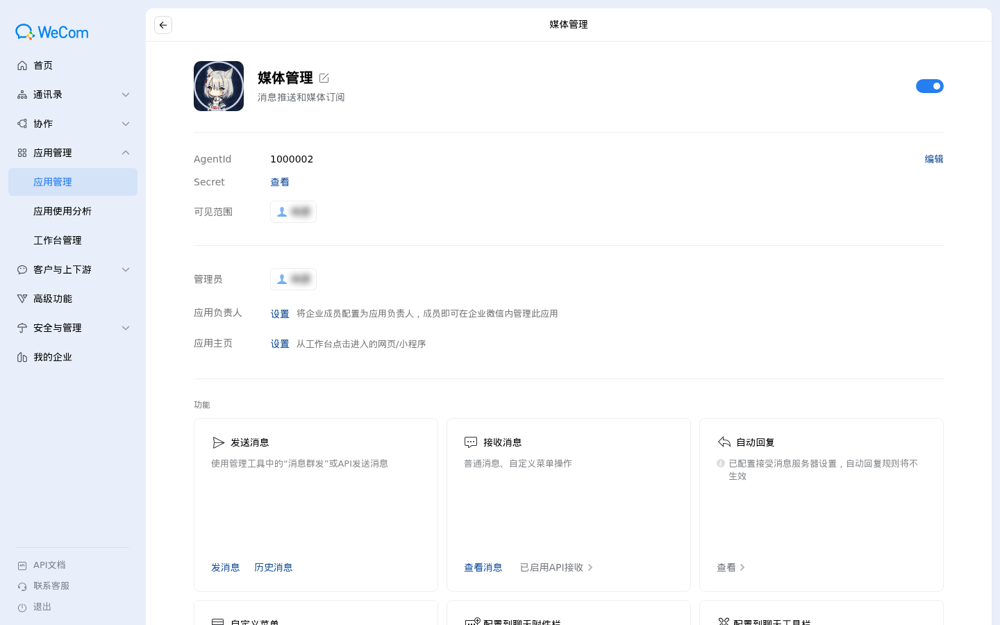
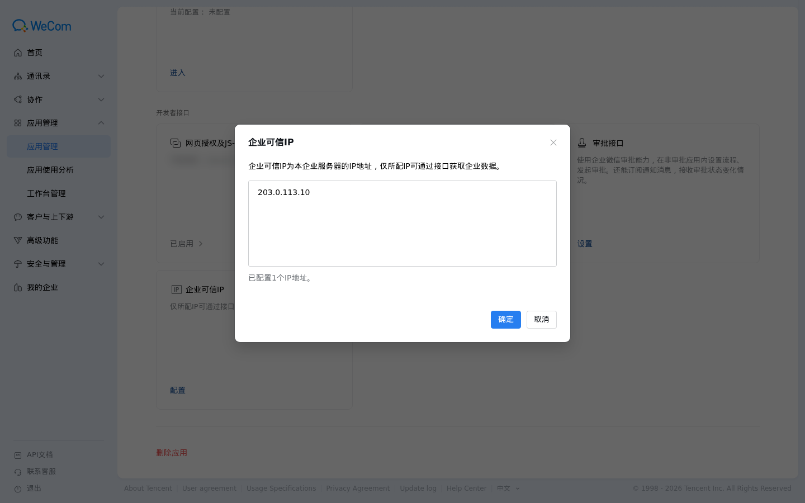
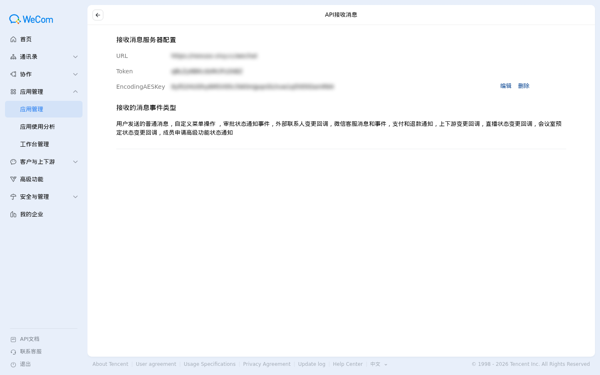
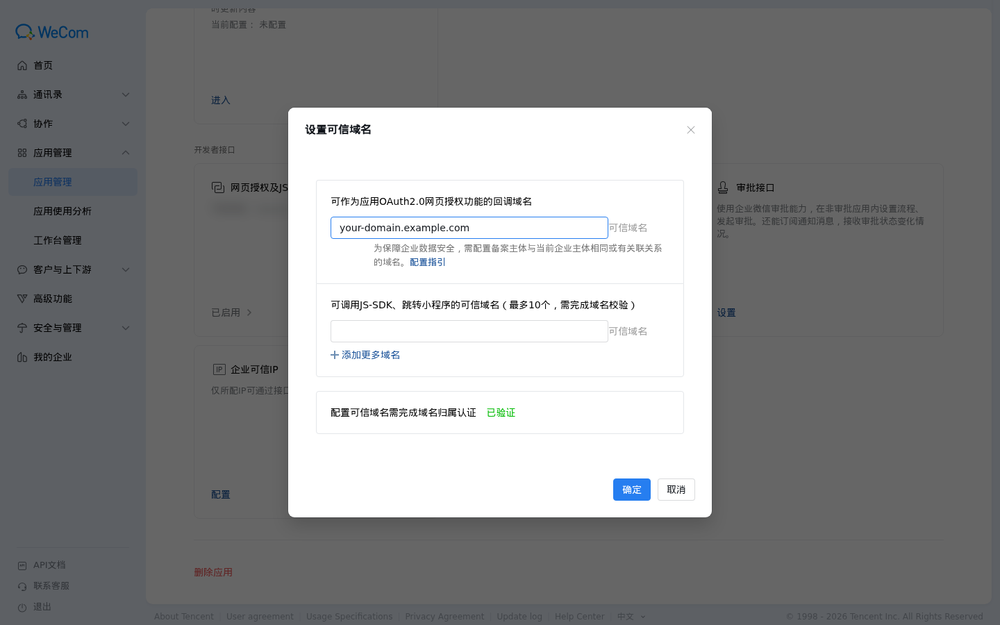
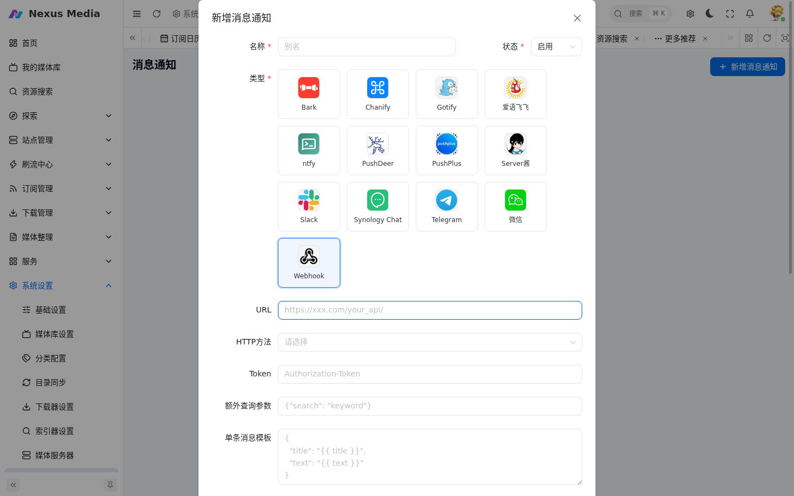

# 通知渠道配置

入口：**系统设置 → 通知设置**（`/system/notification`）。配置消息通知渠道，下载开始、入库完成、订阅成功等事件发生时推送消息。

{ .screenshot }

## 新增消息通知

点击「新增消息通知」，选择渠道类型后填写对应参数。

{ .screenshot }

| 配置项 | 说明 |
|--------|------|
| 名称 | 自定义别名，区分多个渠道 |
| 状态 | 启用 / 停用 |
| 类型 | 见下方渠道列表 |
| 推送设置 | 勾选该渠道接收哪些事件（新增下载、入库完成、站点签到、刷流等 15 类） |
| 消息模板 | 自定义消息格式，详见 [消息通知模板](message_templates.md) |

### 支持的渠道

| 渠道 | 说明 |
|------|------|
| Telegram | Bot 推送，支持交互命令 |
| 微信 | 企业微信应用推送，支持交互菜单（见下文详细配置） |
| 飞书 | 长连接交互 + 带图通知（见下文详细配置，需启用「飞书消息」插件） |
| 钉钉 | Stream 交互 + 机器人单聊通知（见下文详细配置，需启用「钉钉消息」插件） |
| Webhook | 自定义 HTTP 接口推送（见下文详细配置） |
| Bark | iOS 推送 |
| Server酱 | 微信服务号推送 |
| PushPlus | 微信推送 |
| PushDeer | 多端推送 |
| ntfy | 开源推送服务 |
| Gotify | 自建推送服务 |
| Chanify | iOS 推送 |
| Slack | Slack 频道推送 |
| Synology Chat | 群晖 Chat 推送 |
| 爱语飞飞 | IYUU 推送 |

## 飞书

支持双向交互（长连接接收消息 + 卡片按钮）与带图通知（海报随通知推送）。需启用「飞书消息」插件。

### 创建飞书应用

1. 飞书开放平台（https://open.feishu.cn）开发者后台 → 创建**企业自建应用**
2. 「凭证与基础信息」：获取 **App ID（`cli_...`）/ App Secret**
3. 「应用能力」→ 启用「**机器人**」
4. 「事件与回调」：订阅方式选 **WebSocket（长连接）**，事件订阅添加「**接收消息 `im.message.receive_v1`**」（如需卡片按钮回调再加 `card.action.trigger`）
5. **发布应用版本**（未发布则无法接收消息）

### 参数获取

| 配置项 | 获取方式 |
|--------|----------|
| App ID | 开放平台应用「凭证与基础信息」 |
| App Secret | 同上 |
| 通知接收人 open_id | 用户给机器人发消息后事件日志 `sender.sender_id.open_id`；或通讯录权限下 `contact/v3/users/batch_get_id` 按手机号/邮箱查询 |
| 群 chat_id | 把机器人拉进群发消息，事件 `message.chat_id`（`oc_...`） |
| 机器人 Webhook | 群 → 群机器人 → 自定义机器人（可选，Webhook 模式仅通知） |

### 消息中心配置

消息中心新增「飞书」渠道：
- **App ID / App Secret**：必填（应用模式 = 交互 + 通知）
- **通知接收人**：你的 open_id（`ou_...`）或群 chat_id（`oc_...`），逗号分隔
- **交互**：选「是」（长连接随应用凭证自动启动）

> 应用模式与 Webhook 模式：填了 App ID/Secret 即应用模式（交互 + 通知）；只填 Webhook 地址则 Webhook 模式（仅通知）。

### 验证

飞书给机器人发「搜索 三体」→ 收到卡片列表，点「选择」按钮可交互；勾选通知开关后事件通知含海报图片推送。

## 钉钉

支持双向交互（Stream 长连接接收消息）与主动通知（机器人单聊，精准发到个人）。需启用「钉钉消息」插件。

### 创建钉钉应用

1. 钉钉开发者后台（https://open-dev.dingtalk.com）创建**企业内部应用**
2. 「凭证与基础信息」：获取 **AppKey / AppSecret**
3. 「应用能力」→ 添加「**机器人**」（企业机器人）并配置名称/头像
4. 「事件与回调 → 事件订阅」：推送方式选 **Stream 模式**，订阅「**机器人回调**」
5. **发布应用**（未发布则 Stream 连接被拒、机器人不可见）

### 参数获取

| 配置项 | 获取方式 |
|--------|----------|
| App Key | 开放平台应用「凭证与基础信息」 |
| App Secret | 同上 |
| 通知接收人 userId | 用户给机器人发消息自动记录；或通讯录权限下 `topapi/v2/user/getbymobile` 按手机号查询 |
| AgentId | 应用详情页（数字，非必须） |
| 机器人 Webhook | 钉钉客户端 → 群 → 群机器人 → 自定义机器人（可选，兜底） |

### 消息中心配置

消息中心新增「钉钉」渠道：
- **App Key / App Secret**：必填（交互 + 主动通知）
- **通知接收人 userId**：固定填写你自己的 userId（重启后以配置为准）
- **交互**：选「是」触发 Stream 长连接
- 机器人 Webhook / 加签密钥：可选（群 Webhook 兜底）

### 验证

钉钉给机器人发「搜索 三体」→ 收到交互回复；勾选通知开关后主动通知（含海报图片）通过机器人单聊发到个人。

## 微信（企业微信）

{ .screenshot }

### 基础参数（必填）

| 配置项 | 获取方式 |
|--------|----------|
| 企业ID | 企业微信管理后台「我的企业 → 企业信息 → 企业ID」（需管理员权限） |
| 应用Secret | 「应用管理 → 自建应用」查看 Secret |
| 应用ID | 同上，查看 AgentId |

企业ID 获取位置：

{ .screenshot }

自建应用详情页（AgentId / Secret 在此查看）：

{ .screenshot }

### 消息推送代理（IP 白名单问题）

!!! warning
    微信官方限制：**2022 年 6 月 20 日后创建的企业微信应用**，必须将固定公网 IP 加入 IP 白名单才能发送消息。家庭宽带等动态 IP 环境无法直接推送。

解决方案：在拥有固定公网 IP 的服务器上用 Nginx 搭建企业微信 API 专用反向代理，然后在「消息推送代理」中填入该代理地址（如 `https://wecom.example.com`）。所有对 `qyapi.weixin.qq.com` 的请求将经由代理转发，出口 IP 即为代理服务器的固定 IP。

参考配置（`/etc/nginx/sites-available/wecom.conf`，软链到 `sites-enabled`）：

```nginx
server {
    listen 443 ssl;
    http2 on;
    server_name wecom.example.com;   # 改成你自己的域名

    # DNS 解析器，防止腾讯 CDN IP 变更后转发到旧 IP
    resolver 223.5.5.5 119.29.29.29 valid=300s;
    resolver_timeout 5s;

    # SSL 证书配置（略，使用 certbot 或自行配置）
    # ssl_certificate     /path/to/fullchain.pem;
    # ssl_certificate_key /path/to/privkey.pem;

    location /cgi-bin/ {
        set $wecom_api "qyapi.weixin.qq.com";
        proxy_pass https://$wecom_api;

        # HTTPS 后端必须开启 SNI，否则握手可能失败
        proxy_ssl_server_name on;
        proxy_set_header Host qyapi.weixin.qq.com;

        proxy_set_header X-Real-IP       $remote_addr;
        proxy_set_header X-Forwarded-For $proxy_add_x_forwarded_for;

        # 企业微信消息推送可能较慢，超时别设太短
        proxy_connect_timeout 5s;
        proxy_send_timeout    30s;
        proxy_read_timeout    30s;

        proxy_http_version 1.1;
        proxy_set_header Connection "";
        proxy_buffering off;
    }

    # 专用代理，其余路径一律拒绝
    location / {
        return 404;
    }
}

# HTTP 跳转 HTTPS
server {
    listen 80;
    server_name wecom.example.com;
    return 301 https://$host$request_uri;
}
```

配置要点：

1. **必须开启动态 DNS 解析**（`resolver` + 变量写法），腾讯 CDN IP 会变更，直接写域名会导致 nginx 只在启动时解析一次
2. **必须开启 SNI**（`proxy_ssl_server_name on`），否则 HTTPS 握手失败
3. 代理搭建完成后，把**代理服务器的公网 IP** 加入应用的「企业可信IP」：

{ .screenshot }

### 交互功能（可选）

开启「交互」后可通过企业微信菜单直接操作系统（搜索、订阅等）。

| 配置项 | 说明 |
|--------|------|
| Token | 企业微信应用后台「API接收消息 → 接收消息服务器配置」页面生成 |
| EncodingAESKey | 同上页面生成 |
| AdminUser | 可执行交互命令的用户名，多个用 `;` 分割，为空不限制 |

**配置顺序（必须按此步骤）**：

1. 在 Nexus Media 中填入 Token 和 EncodingAESKey 并保存
2. **重启 Nexus Media**
3. 在企业微信后台「API接收消息」的 URL 中填入回调地址并点确定：

   ```
   https://<你的域名>/wechat
   ```

   后端在该路径上同时提供 GET（URL 验证）和 POST（消息接收）。

   { .screenshot }

!!! warning "回调地址可达性"
    前端容器内嵌的 nginx 只转发 `/api`、`/ws` 等路径，**不转发 `/wechat`**。如果通过反向代理暴露服务，需要在反代中将 `/wechat` 直接转发到后端端口：

    ```nginx
    location /wechat {
        proxy_pass http://127.0.0.1:3000;   # 后端宿主机映射端口
        proxy_set_header Host $host;
        proxy_set_header X-Real-IP $remote_addr;
        proxy_set_header X-Forwarded-For $proxy_add_x_forwarded_for;
    }
    ```

### 可信域名

企业微信后台「应用管理 → 你的应用 → 开发者接口 → 网页授权及JS-SDK → 设置可信域名」中配置：

{ .screenshot }

- **OAuth2.0 网页授权回调域名**：填入 Nexus Media 的访问域名（与「外网访问地址」一致），交互菜单跳转免登依赖此项
- **域名归属认证**：按页面提示下载校验文件并放到网站根目录完成验证，显示「已验证」后方可保存
- 可调用 JS-SDK 的可信域名按需添加（最多 10 个）

## Webhook

向自定义 HTTP 接口推送消息，支持 Jinja2 模板自定义请求体，可对接任意第三方服务。

{ .screenshot }

| 配置项 | 说明 |
|--------|------|
| URL | 接收消息的接口地址 |
| HTTP方法 | GET / POST / PUT / PATCH / DELETE。GET 会忽略请求体，列表类消息请用 POST |
| Token | 可选，放入请求头 `Authorization` |
| 额外查询参数 | JSON 字符串，如 `{"search": "keyword"}` |
| 单条消息模板 | Jinja2 JSON 模板，变量：`title`、`text`、`image`、`url`、`user_id` |
| 列表消息模板 | Jinja2 JSON 模板，变量：`title`、`user_id`、`medias`（数组，每项含 `title`、`url`、`type`、`vote`） |

**单条消息模板示例**：

```json
{
  "title": "{{ title }}",
  "text": "{{ text }}"
}
```

**列表消息模板示例**：

```json
{
  "title": "{{ title }}",
  "items": [
    
    {
      "title": "{{ media.title }}"
    },
    
  ]
}
```

!!! tip
    字符串变量默认经过 `tojson` 过滤保证 JSON 合法（中文不转义）；如需输出原始字符串，使用 `|safe` 过滤器。

## 交互安全（IP 白名单）

消息渠道（Telegram、企业微信等）开启「交互」功能后，外部回调请求默认全放行。可在对应渠道的配置中设置 **Webhook IP 白名单**（`webhook_ipv4` / `webhook_ipv6`），仅允许指定来源 IP 访问，避免回调接口被滥用。

- 留空 / 默认：`0.0.0.0/0`、`::/0`（全部放行）
- 示例（Telegram）：IPv4 `149.154.160.0/20,91.108.4.0/22`
- 不在白名单内的请求返回 `403 IP not allowed`

## 下一步

- [消息通知模板](message_templates.md)：自定义每种事件的消息标题和内容格式
- [浏览器系统通知（PWA / Web Push）](webpush.md)：桌面/手机系统通知栏推送
- [基础配置](configuration.md)：Telegram 访问不通时配置代理服务器
