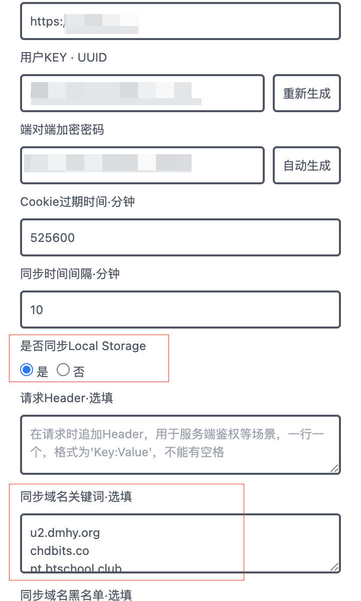

# 插件配置指南

NAS-Tools提供了丰富的插件系统，可以扩展系统的功能。本章将详细介绍各个插件的使用方法。

## 插件列表

### 自动签到插件

自动签到插件是NAS-Tools中用于自动执行PT站点签到的重要功能，可以帮助用户保持站点活跃度，避免因长时间不登录而被清理账号。

#### 功能概述

- **自动签到**：支持定时自动执行站点签到
- **Cookie同步**：通过CookieCloud同步浏览器Cookie
- **仿真登录**：支持浏览器仿真登录，应对Cloudflare防护
- **重试机制**：支持失败站点重试和特殊站点强制签到
- **通知提醒**：签到结果实时通知

#### 前置准备

##### 1. 安装nas-tools-chrome容器

自动签到需要浏览器仿真功能，需要安装nas-tools-chrome容器：

1. 在docker-compose.yml中添加chrome服务配置：
   ```yaml
   chrome:
     image: linyuan0213/nas-tools-chrome:latest
     container_name: nas-tools-chrome
     shm_size: 2g # 共享内存大小
     volumes:
       - ./data:/var/lib/chromium/user_data
     ports:
       - 9850:9850
       - 6080:6080
     restart: always
   ```

2. 启动chrome容器：
   ```bash
   docker-compose up -d chrome
   ```

3. 验证容器运行状态：
   ```bash
   docker ps | grep nas-tools-chrome
   ```

##### 2. 配置网页自动化服务器

在NAS-Tools中配置网页自动化服务器：

1. 进入 **基础设置** → **实验室** → **网页自动化服务器**
2. 填写配置参数：
   - **服务器地址**: 填写nas-tools-chrome容器的访问地址，如 `http://192.168.1.151:9850`
   - 确保地址可访问，端口9850是DrissionPage服务的默认端口

##### 3. 安装CookieCloud浏览器插件

首先需要在浏览器中安装CookieCloud插件：

1. 访问 [CookieCloud GitHub页面](https://github.com/easychen/CookieCloud)
2. 根据浏览器类型安装对应的插件：
   - Chrome/Edge: 从Chrome Web Store安装
   - Firefox: 从Firefox Add-ons安装

##### 4. 配置CookieCloud插件

安装完成后，配置CookieCloud插件：

1. 打开CookieCloud插件设置
2. 设置服务器地址（可使用公共服务器或自建服务器）
3. 生成用户KEY和端对端加密密码
4. **重要：设置是否同步Local Storage选"是"**
5. 设置同步域名关键词（需要同步的PT站点域名）



##### 5. 手动登录网站

在配置CookieCloud同步前，需要手动登录一次目标PT网站：

1. 打开浏览器，访问目标PT站点
2. 正常登录账号
3. 确保登录状态正常

##### 6. 同步Cookie

在CookieCloud插件中执行同步操作：

1. 点击CookieCloud插件的同步按钮
2. 确认Cookie数据已成功上传到云端
3. 在NAS-Tools中配置CookieCloud参数

#### 插件配置

##### CookieCloud同步插件配置

在NAS-Tools中配置CookieCloud同步：

1. 进入 **插件** → **CookieCloud同步**
2. 填写配置参数：
   - **服务器地址**: CookieCloud服务器地址
   - **用户KEY**: CookieCloud插件中生成的KEY
   - **端对端加密密码**: CookieCloud插件中设置的密码
   - **执行周期**: 设置自动同步周期（如：`0 0 * * *` 每天零点执行）
   - **白名单**: 需要同步的域名关键词（每行一个，支持正则）
   - **黑名单**: 需要排除的域名关键词


##### 自动签到插件配置

在NAS-Tools中配置自动签到：

1. 进入 **插件** → **站点自动签到**
2. 填写配置参数：
   - **开启定时签到**: 启用自动签到功能
   - **签到周期**: 设置签到执行时间
     - 间隔时间：如 `23.5`（23.5小时）
     - 固定时间：如 `08:00`（每天8点）
     - 时间范围：如 `08:00-09:00`（8-9点间随机执行）
     - Cron表达式：如 `0 8 * * *`（每天8点）
   - **签到队列**: 同时签到的站点数量（默认10）
   - **重试关键词**: 失败时重试的关键词（支持正则）
   - **运行时通知**: 开启签到结果通知
   - **立即运行一次**: 首次配置时测试功能

3. 选择签到站点：
   - **签到站点**: 选择需要自动签到的站点
   - **特殊站点**: 选择无论是否失败都强制重签的站点
   - **仿真站点**: 选择需要开启浏览器仿真的站点

#### 仿真功能说明

##### 何时需要开启仿真

以下情况建议开启仿真功能：

1. **Cloudflare 5秒盾防护**的站点
2. **雷池防护**的站点  
3. **馒头（M-Team）站点** - 必须开启仿真才能正常登录
4. 其他使用复杂反爬虫机制的站点

##### 仿真站点配置

在自动签到插件的"仿真站点"选项中，选择需要开启浏览器仿真的站点：

- 馒头（M-Team）必须选中
- 其他有Cloudflare防护的站点建议选中
- 仿真会使用真实浏览器进行登录，成功率更高但耗时较长

#### 常见问题

##### Q: 签到失败，提示"Cookie已失效"
A: 需要重新同步Cookie：
1. 在浏览器中重新登录网站
2. 在CookieCloud插件中重新同步
3. 在NAS-Tools中执行CookieCloud同步

##### Q: 站点被Cloudflare防护，无法签到
A: 需要开启仿真功能：
1. 在自动签到插件中，将该站点添加到"仿真站点"
2. 确保DrissionPage服务正常运行

##### Q: 馒头站点登录失败
A: 馒头必须使用仿真登录：
1. 确认已开启仿真功能
2. 检查Local Storage同步是否正常
3. 确保CookieCloud中设置了同步Local Storage

##### Q: 签到结果通知不显示
A: 检查通知配置：
1. 确认已开启"运行时通知"选项
2. 检查消息通知渠道是否配置正确
3. 查看系统日志确认通知发送状态

#### 最佳实践

##### 1. 签到时间安排
- 建议设置在网站访问量较少的时段
- 避免在网站维护时段执行签到
- 考虑不同站点的时区差异

##### 2. 队列数量设置
- 高性能服务器可设置较大队列（10-20）
- 低性能服务器建议设置较小队列（5-10）
- 根据实际签到成功率调整

##### 3. 重试策略
- 设置合理的重试关键词（如：失败|错误|异常）
- 对于重要站点可设置为特殊站点强制重签
- 定期检查签到历史，优化配置

##### 4. 安全注意事项
- 使用自建CookieCloud服务器提高安全性
- 定期更换CookieCloud的KEY和密码
- 不要在公共网络中泄露CookieCloud配置信息

#### 故障排除

##### 检查日志
查看系统日志了解详细的签到过程：
- 成功站点的签到记录
- 失败站点的错误信息
- 仿真登录的执行状态

##### 手动测试
在配置完成后，建议：
1. 使用"立即运行一次"功能测试
2. 检查签到结果通知
3. 根据结果调整配置参数
