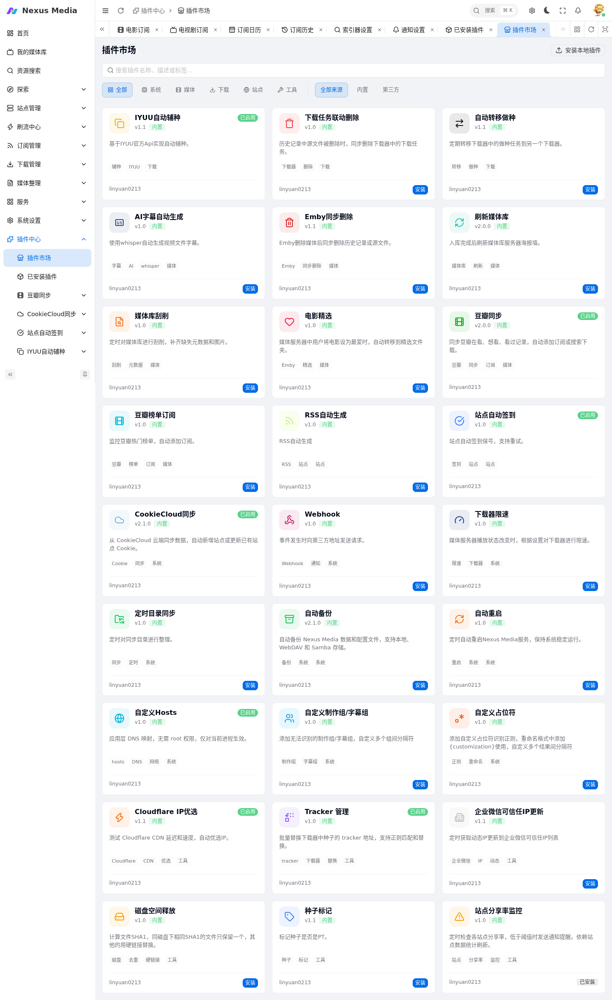
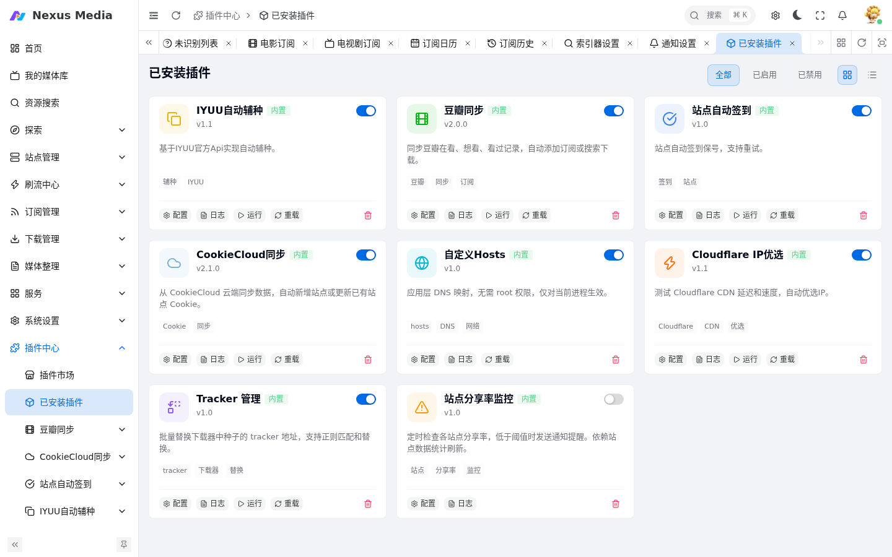

# 插件配置指南

Nexus Media 提供了丰富的插件系统，可以扩展系统的功能。本章将详细介绍各个插件的使用方法。

入口：**插件中心 → 插件市场**（`/plugin/market`）安装插件，**插件中心 → 已安装插件**（`/plugin/installed`）管理插件。

{ .screenshot }

{ .screenshot }

## 插件列表

### 自动签到插件

自动签到插件是 Nexus Media 中用于自动执行PT站点签到的重要功能，可以帮助用户保持站点活跃度，避免因长时间不登录而被清理账号。

#### 功能概述

- **自动签到**：支持定时自动执行站点签到
- **Cookie同步**：通过CookieCloud同步浏览器Cookie
- **浏览器自动化签到**：支持浏览器自动化签到，应对Cloudflare防护

#### 前置准备

##### 1. 安装 nexus-chrome 容器

自动签到的浏览器自动化功能依赖 nexus-chrome 组件，安装与参数说明见 [安装指南 → 可选组件](installation.md#可选组件nexus-verify-与-nexus-chrome)。

##### 2. 配置网页自动化服务器

在 Nexus Media 中配置网页自动化服务器：

1. 进入 **基础设置**（`/system/basic`） → **实验室**，开启「启用网页自动化」
2. 「网页自动化服务器」填写 nexus-chrome 容器的访问地址，如 `http://192.168.1.151:9850`
3. 确保地址可访问，端口 9850 是 DrissionPage 服务的默认端口

##### 3. 安装CookieCloud浏览器插件

首先需要在浏览器中安装CookieCloud插件：

1. 访问 [CookieCloud GitHub页面](https://github.com/easychen/CookieCloud)
2. 根据浏览器类型安装对应的插件：
   - Chrome/Edge: 从Chrome Web Store安装
   - Firefox: 从Firefox Add-ons安装

##### 4. 配置CookieCloud插件

安装完成后，配置CookieCloud插件：

1. 打开CookieCloud插件设置
2. 设置服务器地址（可使用公共服务器或自建服务器）
3. 生成用户KEY和端对端加密密码
4. **重要：设置是否同步 Local Storage 选「是」**
5. 设置同步域名关键词（需要同步的 PT 站点域名）

##### 5. 手动登录网站

在配置CookieCloud同步前，需要手动登录一次目标PT网站：

1. 打开浏览器，访问目标PT站点
2. 正常登录账号
3. 确保登录状态正常

##### 6. 同步Cookie

在CookieCloud插件中执行同步操作：

1. 点击CookieCloud插件的同步按钮
2. 确认Cookie数据已成功上传到云端
3. 在 Nexus Media 中配置CookieCloud参数

#### 插件配置

##### CookieCloud同步插件配置

在 Nexus Media 中配置CookieCloud同步：

1. 进入 **已安装插件**（`/plugin/installed`） → **CookieCloud同步**
2. 填写配置参数：
   - **服务器地址**: CookieCloud服务器地址
   - **用户KEY**: CookieCloud插件中生成的KEY
   - **端对端加密密码**: CookieCloud插件中设置的密码
   - **执行周期**: 设置自动同步周期（如：`0 0 * * *` 每天零点执行）
   - **白名单**: 需要同步的域名关键词（每行一个，支持正则）
   - **黑名单**: 需要排除的域名关键词

##### 自动签到插件配置

在 Nexus Media 中配置自动签到：

1. 进入 **已安装插件**（`/plugin/installed`） → **站点自动签到**
2. 填写配置参数：
   - **开启定时签到**: 启用自动签到功能
   - **签到周期**: 设置签到执行时间
     - 间隔时间：如 `23.5`（23.5小时）
     - 固定时间：如 `08:00`（每天8点）
     - 时间范围：如 `08:00-09:00`（8-9点间随机执行）
     - Cron表达式：如 `0 8 * * *`（每天8点）
   - **签到队列**: 同时签到的站点数量（默认10）
   - **重试关键词**: 失败时重试的关键词（支持正则）
   - **运行时通知**: 开启签到结果通知
   - **立即运行一次**: 首次配置时测试功能

3. 选择签到站点：
   - **签到站点**: 选择需要自动签到的站点
   - **特殊站点**: 选择无论是否失败都强制重签的站点
    - **浏览器站点**: 选择需要开启浏览器自动化的站点

#### 浏览器自动化功能说明

##### 何时需要开启浏览器自动化

以下情况建议开启浏览器自动化功能：

1. **Cloudflare 5秒盾防护**的站点
2. **雷池防护**的站点  
3. 其他使用复杂反爬虫机制的站点

##### 浏览器站点配置

在自动签到插件的"浏览器站点"选项中，选择需要开启浏览器自动化的站点：

- 有Cloudflare防护的站点建议选中
- 浏览器自动化会使用真实浏览器进行登录，成功率更高但耗时较长

#### 常见问题

##### Q: 签到失败，提示"Cookie已失效"
A: 需要重新同步Cookie：
1. 在浏览器中重新登录网站
2. 在CookieCloud插件中重新同步
3. 在 Nexus Media 中执行CookieCloud同步

##### Q: 站点被Cloudflare防护，无法签到
A: 需要开启浏览器自动化功能：
1. 在自动签到插件中，将该站点添加到"浏览器站点"
2. 确保DrissionPage服务正常运行

##### Q: 签到结果通知不显示
A: 检查通知配置：
1. 确认已开启"运行时通知"选项
2. 检查消息通知渠道是否配置正确
3. 查看系统日志确认通知发送状态

#### 最佳实践

##### 1. 签到时间安排
- 建议设置在网站访问量较少的时段
- 避免在网站维护时段执行签到
- 考虑不同站点的时区差异

##### 2. 队列数量设置
- 高性能服务器可设置较大队列（10-20）
- 低性能服务器建议设置较小队列（5-10）
- 根据实际签到成功率调整

##### 3. 重试策略
- 设置合理的重试关键词（如：失败|错误|异常）
- 对于重要站点可设置为特殊站点强制重签
- 定期检查签到历史，优化配置

##### 4. 安全注意事项
- 使用自建CookieCloud服务器提高安全性
- 定期更换CookieCloud的KEY和密码
- 不要在公共网络中泄露CookieCloud配置信息

#### 故障排除

##### 检查日志
查看系统日志了解详细的签到过程：
- 成功站点的签到记录
- 失败站点的错误信息
- 浏览器自动化签到的执行状态

##### 手动测试
在配置完成后，建议：
1. 使用"立即运行一次"功能测试
2. 检查签到结果通知
3. 根据结果调整配置参数
