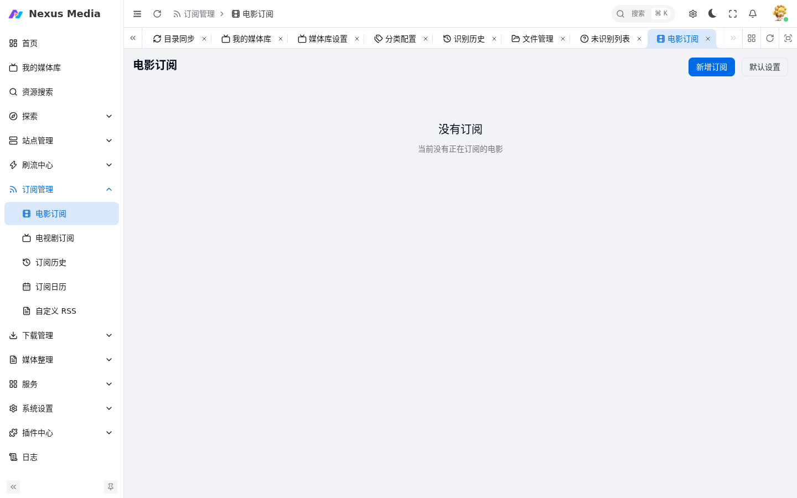
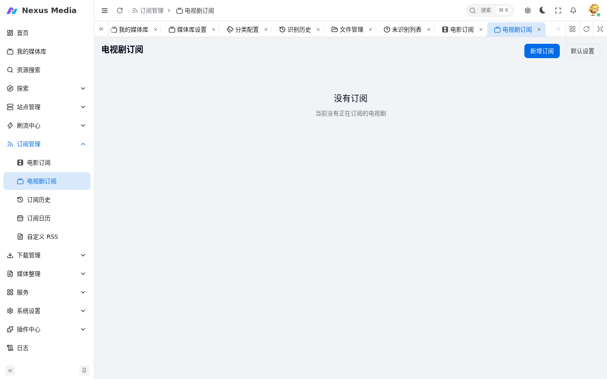
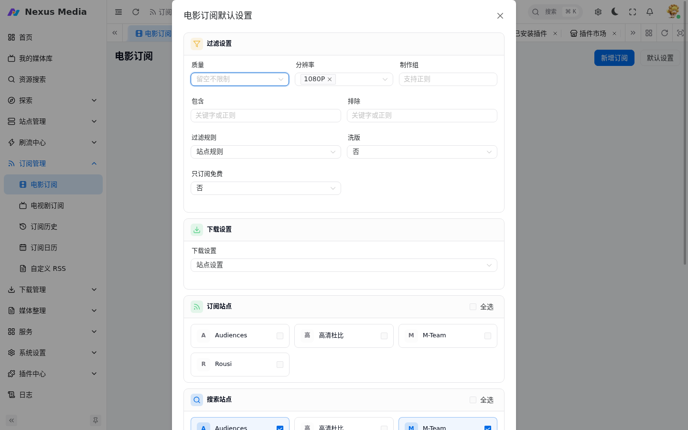
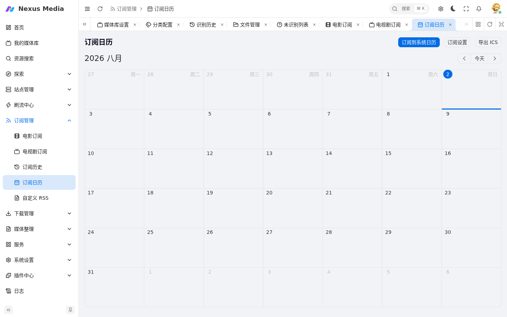
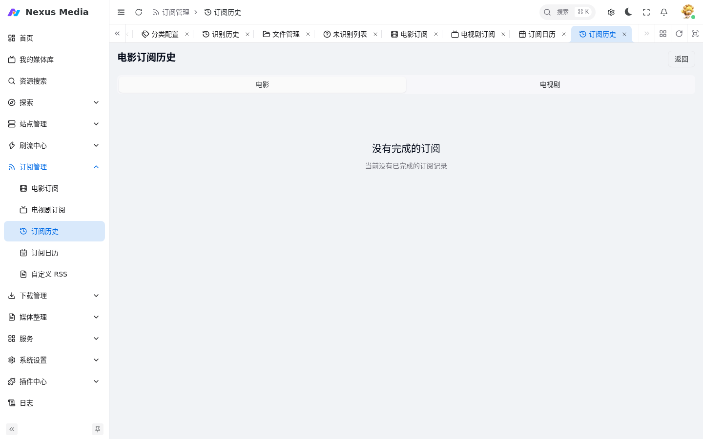

# RSS 订阅

订阅管理菜单包含：电影订阅、电视剧订阅、订阅日历、订阅历史。

## 电影订阅

入口：**订阅管理 → 电影订阅**（`/subscription/movie`）。

{ .screenshot }

新增订阅：

1. 在 **探索**（推荐 / 榜单 / 豆瓣）或 **资源搜索**（`/media/search`）中找到影片
2. 点击「订阅」按钮，选择质量偏好和站点范围
3. 保存后在电影订阅列表中管理

## 电视剧订阅

入口：**订阅管理 → 电视剧订阅**（`/subscription/tv`）。

{ .screenshot }

新增订阅时可选择：

- **整季订阅**：自动下载全季
- **缺集订阅**：只下载缺少的集数

## 订阅默认设置

电影订阅和电视剧订阅页面右上角均有「默认设置」按钮，新增订阅时默认套用这里的配置，电影和电视剧需**分别配置**。

{ .screenshot }

**过滤设置**：

| 配置项 | 说明 |
|--------|------|
| 质量 | 资源质量偏好，留空不限制 |
| 分辨率 | 如 1080P、4K |
| 制作组 | 支持正则 |
| 包含 / 排除 | 关键字或正则，命中包含才下载、命中排除则跳过 |
| 过滤规则 | 关联站点规则 |
| 洗版 | 有更优版本时是否替换已下载内容 |
| 只订阅免费 | 只下载 FREE 促销种子 |

**下载设置**：关联 [下载设置](download_management.md#下载设置) 中的参数模板（下载器、限速、标签等）。

**站点设置**：

- **订阅站点**：RSS 刷新时检查的站点（需在 [站点维护](sites.md) 中开启「订阅」功能）
- **搜索站点**：缺集搜索时使用的站点（需在 [索引器设置](indexers.md) 中启用）

!!! warning "必须先配置站点"
    电影和电视剧的订阅站点、搜索站点都依赖已添加的站点。**没有配置任何站点时，订阅无法 RSS 刷新也无法搜索补种**。请先在 **站点管理 → 站点维护** 添加站点并开启对应功能，再回来勾选。

## 订阅管理操作

| 操作 | 说明 |
|------|------|
| 暂停/恢复 | 临时停止或恢复 RSS 检查 |
| 编辑 | 修改质量要求、站点范围 |
| 删除 | 移除订阅，已下载的媒体保留 |
| 搜索下载 | 手动触发一次全站搜索 |

## 订阅日历

入口：**订阅管理 → 订阅日历**（`/subscription/calendar`）。按日历视图展示订阅剧集的更新和入库情况。

{ .screenshot }

## 订阅历史

入口：**订阅管理 → 订阅历史**（`/subscription/history`）。查看订阅的完成记录。

{ .screenshot }

## 自定义 RSS

入口：`/subscription/user`。支持添加第三方 RSS 地址直接解析：

1. 添加 RSS 地址和解析规则
2. 设置匹配关键字和下载器

## 订阅工作原理

1. **RSS 周期**：按配置间隔检查站点 RSS 更新
2. **匹配**：根据订阅的 TMDB ID 匹配种子
3. **过滤**：应用用户设置的质量、站点过滤
4. **下载**：匹配成功后自动添加到下载器
5. **通知**：下载开始/完成时发送通知

## 配置建议

- RSS 检查周期建议 ≥ 300 秒，避免对站点造成压力
- 搜索周期建议 ≥ 6 小时
- 开启「远程下载不完整自动订阅」可在手动搜索无结果时自动转为 RSS 订阅

周期配置见 [基础配置 → 服务](configuration.md#服务)。
