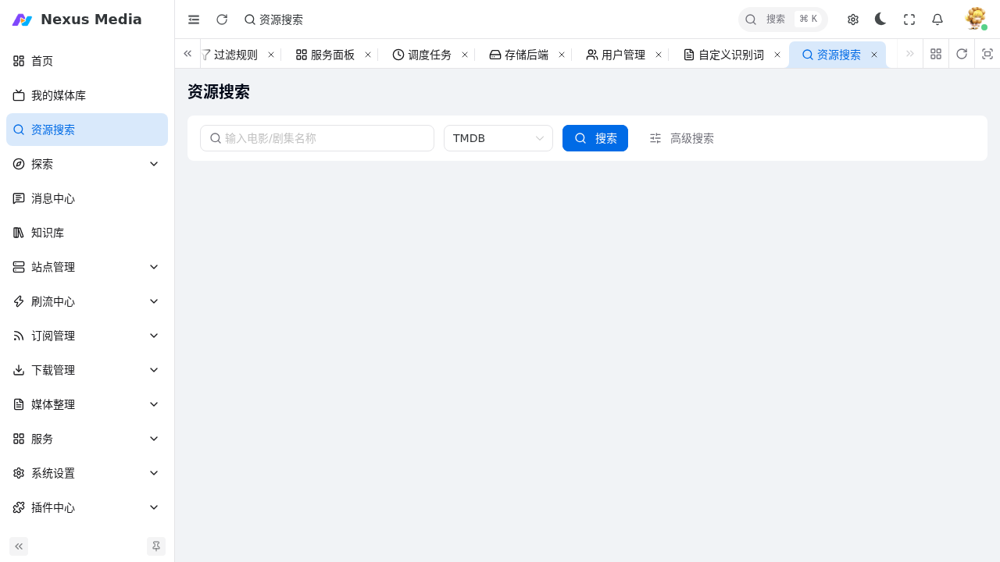

# 资源搜索与探索

## 资源搜索

入口：**资源搜索**（`/media/search`）。按名称搜索影视资源，通过 [索引器](indexers.md) 并发搜索已配置的站点，按 [下载优先级](indexers.md#择优下载) 择优。

{ .screenshot }

- **输入名称**：支持中文名与英文原名，可加年份提高匹配精度
- **TMDB 搜索**：先经 TMDB 识别，再以识别出的名称搜索资源
- **高级搜索**：可指定站点、类型、年份等条件
- 搜索结果可查看详情并一键订阅或下载

## 探索

入口：**探索** 菜单，提供多种找片渠道：

| 渠道 | 说明 |
|------|------|
| 推荐 | 个性化推荐（`/discovery/recommend`） |
| 榜单 | TMDB 热门榜单（电影/剧集） |
| 豆瓣 | 豆瓣热门/高分（电影/剧集） |
| 番组 | Bangumi 番剧索引 |

在探索页找到影片后可查看详情、加入订阅或直接下载。

## 媒体详情

点击任一搜索结果或探索影片进入详情页（`/media/detail`），展示：

- TMDB 元数据（简介、海报、评分、演职员）
- 已搜索到的资源列表（按 [下载优先级](indexers.md#择优下载) 排序）
- 下载、订阅、查看是否已入库等操作

## 相关配置

- 搜索使用的站点需在 [站点维护](sites.md) 开启「站点搜索」并在 [索引器设置](indexers.md) 启用
- 搜索后是否自动下载由 [基础配置 → 服务](configuration.md#服务) 的「远程搜索自动择优下载」控制
