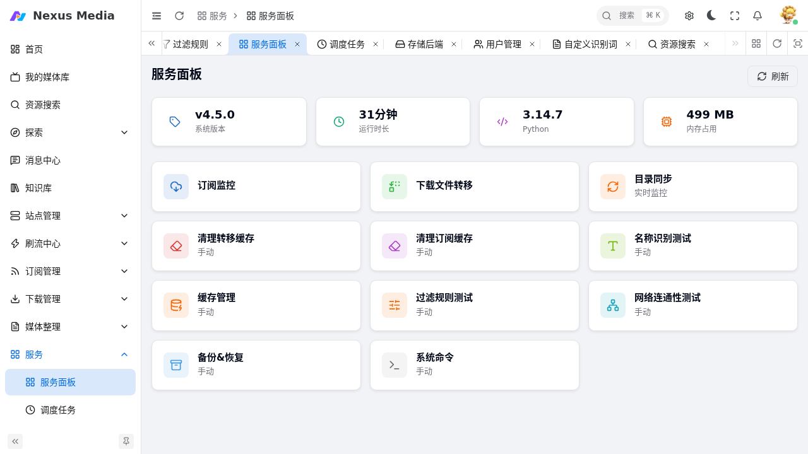
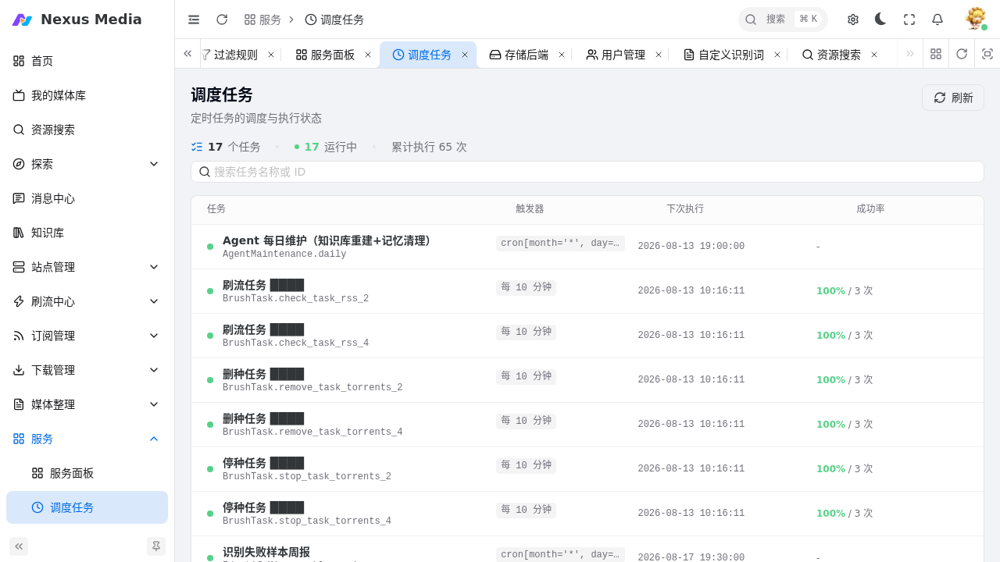

# 服务面板与调度任务

**服务** 菜单包含两个页面：**服务面板**（后台服务状态与手动操作）和 **调度任务**（定时任务调度与执行状态）。

## 服务面板

入口：**服务 → 服务面板**（`/service/panel`）。

{ .screenshot }

顶部展示系统运行状态：

| 指标 | 说明 |
|------|------|
| 系统版本 | 当前运行版本 |
| 运行时长 | 服务已运行时间 |
| Python | Python 运行环境版本 |
| 内存占用 | 进程内存使用情况 |

下方是各后台服务的手动操作入口：

| 操作 | 说明 |
|------|------|
| 订阅监控 | 手动触发一次订阅 RSS 检查 |
| 下载文件转移 | 手动触发下载完成后的文件转移 |
| 目录同步 | 手动触发一次目录同步扫描 |
| 实时监控 | 手动触发下载器监控 |
| 清理转移缓存 / 清理订阅缓存 | 清理对应缓存 |
| 名称识别测试 | 测试种子名称的识别结果 |
| 缓存管理 | 查看/清理各类缓存 |
| 过滤规则测试 | 测试种子是否符合过滤规则 |
| 网络连通性测试 | 测试 TMDB、代理、各站点连通性 |
| 备份&恢复 | 配置备份与恢复 |
| 系统命令 | 查看系统信息等运维命令 |

## 调度任务

入口：**服务 → 调度任务**（`/service/scheduler`）。

{ .screenshot }

以列表形式展示全部定时任务：

| 列 | 说明 |
|----|------|
| 任务 | 任务名称（如刷流任务的 RSS 检查/删种、Agent 每日维护等） |
| 触发器 | 触发方式：`cron[...]` 表达式或固定间隔（如每 10 分钟） |
| 下次执行 | 下一次执行时间 |
| 成功率 | 历史执行成功率（成功次数 / 总次数） |

- 每个任务的触发周期由对应功能配置决定（如 [基础配置 → 服务](configuration.md#服务) 中的 RSS 周期、[刷流任务](sites.md#刷流任务) 的执行周期）
- 任务的实时运行状态、内存占用等详情在服务面板与系统日志中查看

## 常见问题

**服务面板手动操作无反应**

1. 确认服务正在运行（容器状态正常）
2. 查看 [系统日志](users.md#系统日志) 中的相关错误
3. 部分操作（如订阅监控）需要依赖的站点/下载器配置正常