# 站点配置

站点相关功能分为三块：**站点管理**（维护站点、看数据）、**刷流中心**（自动刷流）、以及基础设置中的**站点配置热更新**。

## 站点维护

入口：**站点管理 → 站点维护**（`/site/list`）。已添加的站点以卡片形式展示，每张卡片提供编辑、删除、连通性测试、更新 Cookie 等操作。

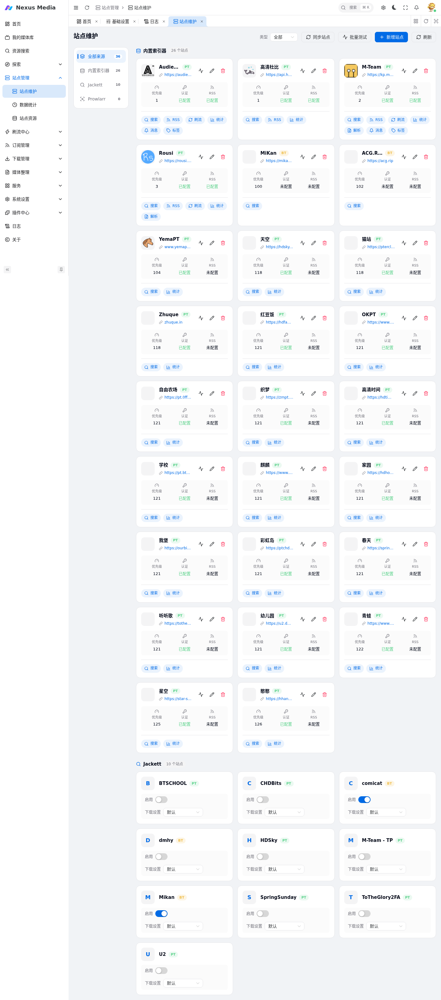{ .screenshot }

### 新增站点

点击「添加站点」按钮，按向导分 5 步完成配置。

**第 1 步：基础信息**

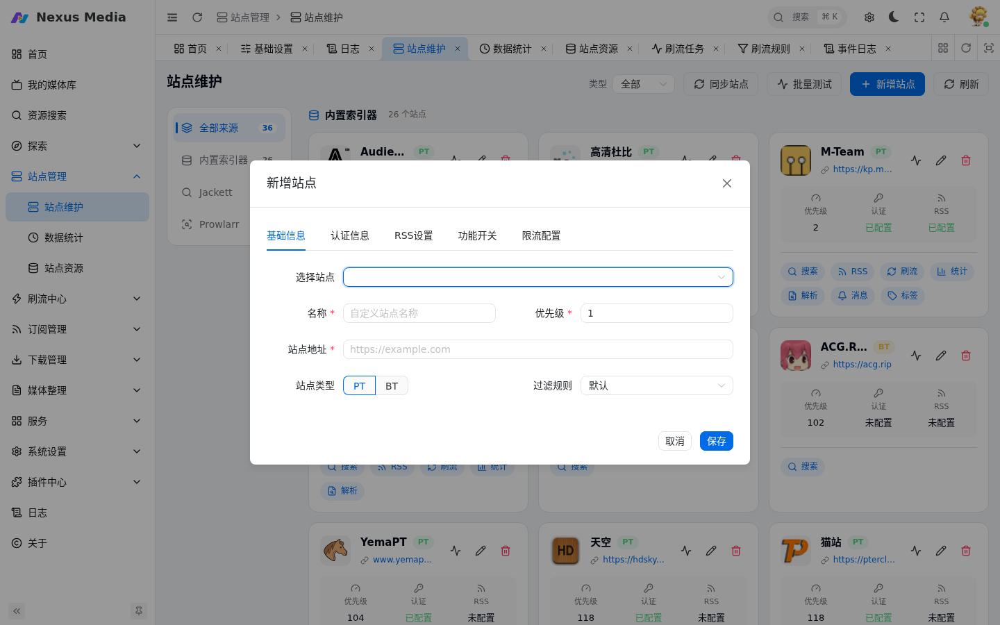{ .screenshot }

| 配置项 | 说明 |
|--------|------|
| 选择站点 | 从支持的站点列表中选择，自动填充站点地址和解析规则 |
| 名称 | 自定义显示名称 |
| 优先级 | 数值**越小优先级越高**（主站建议设为 1），搜索、择优下载时优先使用该站点 |
| 站点类型 | PT / BT |
| 过滤规则 | 关联 [过滤规则](filter_rules.md) 中的规则组 |

**第 2 步：认证信息**

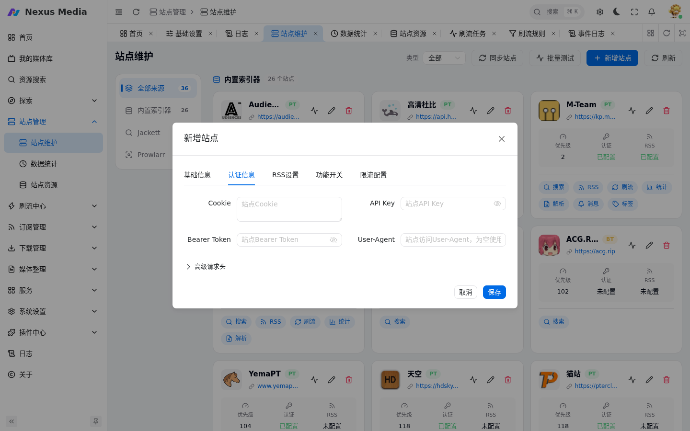{ .screenshot }

```yaml
site_url: "/attendance.php"  # 建议设为签到页面
cookie: "xxxxxx"             # 通过浏览器 F12 开发者工具获取
user_agent: "Mozilla/5.0"    # 需与 Cookie 同时配置，保持一致
```

**第 3 步：RSS 设置**

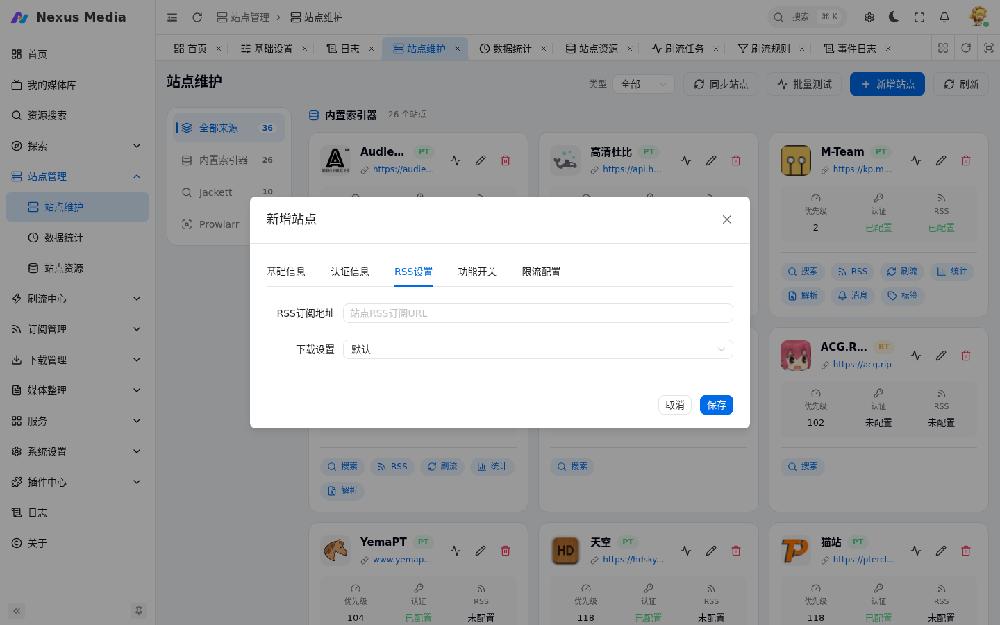{ .screenshot }

RSS 订阅地址用于电影/电视剧订阅和刷流。

!!! warning
    解析种子详情会增加站点压力，RSS 周期不要设置过短（建议 ≥ 300 秒）。

**第 4 步：功能开关**

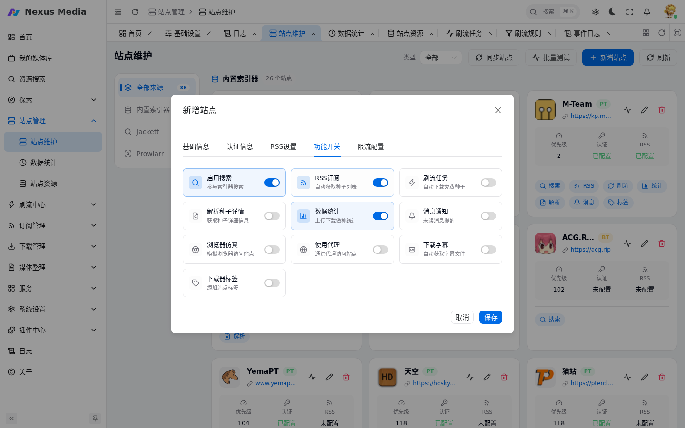{ .screenshot }

| 选项 | 说明 |
|------|------|
| 订阅 | 启用后可用于 RSS 订阅 |
| 刷流 | 启用后可用于刷流任务 |
| 数据统计 | 启用后收集站点上传下载等数据 |
| 站点搜索 | 需在内建索引器中单独设置 |

**第 5 步：限流配置**

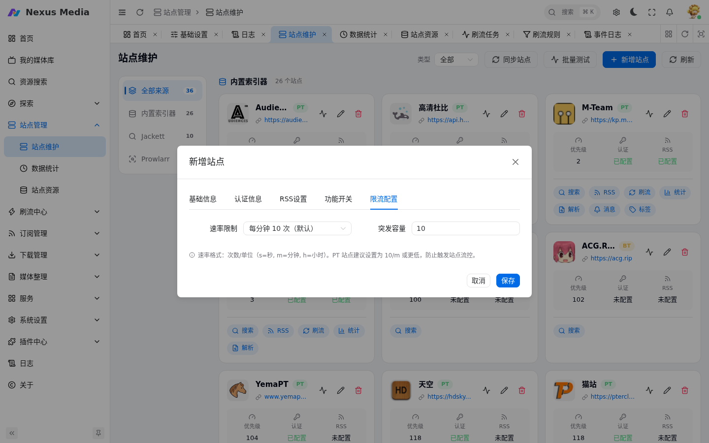{ .screenshot }

控制对该站点的请求频率，避免触发站点风控。

### 特殊站点配置

API 类站点无需手动配请求头，在新增站点向导第 2 步「认证信息」中直接填 API Key 或 Bearer Token 即可。

#### 馒头（M-Team）

1. 登录馒头站点，进入 **控制台 → 实验室 → 存取令牌**，点击「建立存取令牌」生成新令牌
2. 在站点「认证信息」的 **API Key** 中粘贴令牌（系统会自动以 `x-api-key` 请求头发送）
3. 按需配置 User-Agent

#### 肉丝（Rousi）

1. 登录肉丝站点，进入「账户设置」复制 **Passkey**
2. 在站点「认证信息」的 **Bearer Token** 中粘贴（无需 `Bearer ` 前缀，系统自动处理）
3. 签到配置（可选）：自动签到需要在请求头参数中额外添加签到专用 token：
   ```json
   {"x-sign-token": "你的签到令牌"}
   ```
   或通过 CookieCloud 同步 local_storage 中的 token 数据。

#### 夜梦（YemaPT）

1. 登录夜梦站点，在个人详情页创建 **API AuthKey**（有效期 180 天，每个账号最多同时保留 3 个）
2. 在站点「认证信息」的 **API Key** 中粘贴 AuthKey
3. 系统会以 `Authorization: <AuthKey>` 请求头发送。注意：**不要**填在「Bearer Token」字段——夜梦开放 API 要求 `Authorization` 直接携带 AuthKey，不允许 `Bearer ` 前缀（填入 Bearer 字段会导致接口返回 403 `need api auth`，站点测试显示「密钥失效」）

### 更新站点 Cookie

- 点击站点卡片的「圆点图标」打开更新对话框（当前环境无浏览器内核时该图标不可见）
- 输入用户名、密码后，自动调用浏览器模拟人工登录，获取 Cookie 和 UA 并更新
- 可选择自动识别验证码（成功率约 90%）或手工输入验证码

### 站点连通性测试

点击卡片上的测试按钮，根据报错信息调整站点设置和网络环境，排查参考文末 [常见问题](#常见问题)。

## 数据统计

入口：**站点管理 → 数据统计**（`/site/statistics`）。展示各站点的上传量、下载量、分享率、做种数等数据。

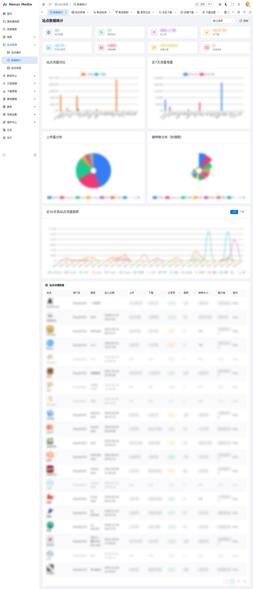{ .screenshot }

- **自动刷新**：在 [基础设置 → 服务](configuration.md#服务) 中配置「站点数据刷新时间」，开启「站点消息」后将推送当日增量数据
- **手动刷新**：点击「站点数据」栏的刷新按钮刷新全部站点；点击单个站点图标只刷新该站点
- **数据分享**：点击分享按钮生成站点统计图片，自动对敏感信息模糊处理，可用于分享求邀

## 站点资源

入口：**站点管理 → 站点资源**（`/site/resources`）。

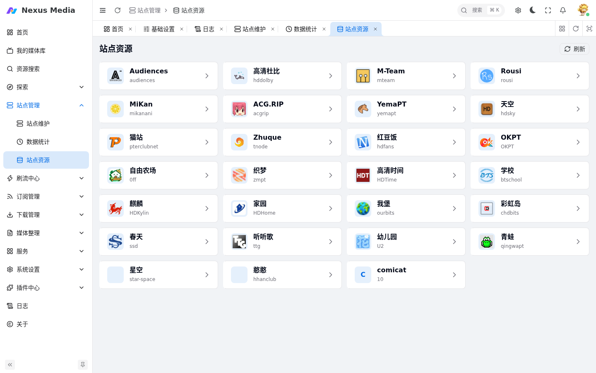{ .screenshot }

站点维护好后，点击卡片即可浏览站点首页资源；选中资源后点击「一键下载」可批量添加至下载器。如无法显示资源，请检查 Cookie 和站点连通性。

## 刷流中心

!!! danger "安全警告"
    刷流功能存在风险，极端情况可能导致保种丢失！建议使用独立的下载器专门处理刷流任务。

### 刷流规则

入口：**刷流中心 → 刷流规则**（`/brush/rules`）。规则是模板化配置，供刷流任务引用。

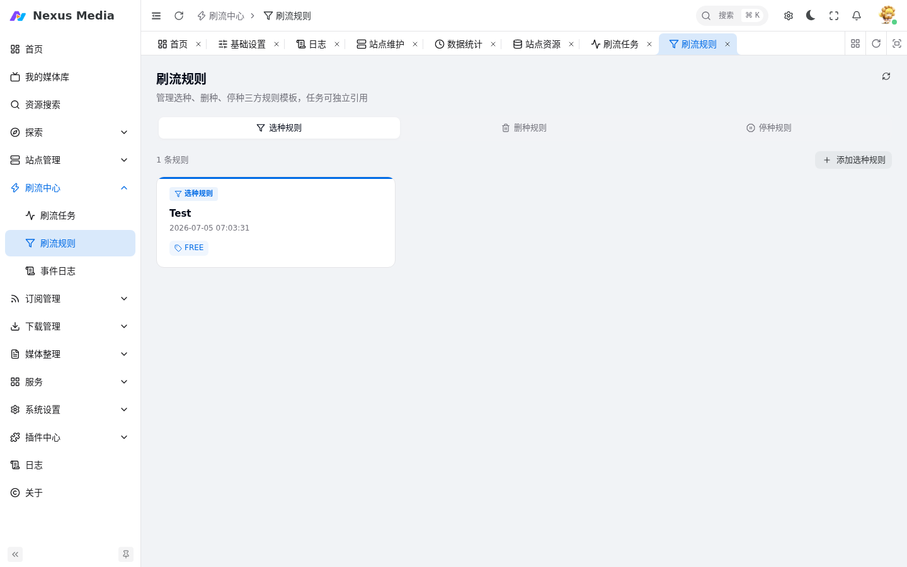{ .screenshot }

- **规则名称**：便于在任务中选择引用
- **选种规则**：筛选条件，如站点、促销类型、体积范围、做种人数等
- **删种规则**：自动删除条件，如分享率、做种时间、上传量/下载量阈值等
- **停种规则**：暂停条件，如达到指定分享率或做种时间后停止做种

!!! note
    规则本身不会执行，需要在刷流任务中引用后才能生效。

### 刷流任务

入口：**刷流中心 → 刷流任务**（`/brush`）。

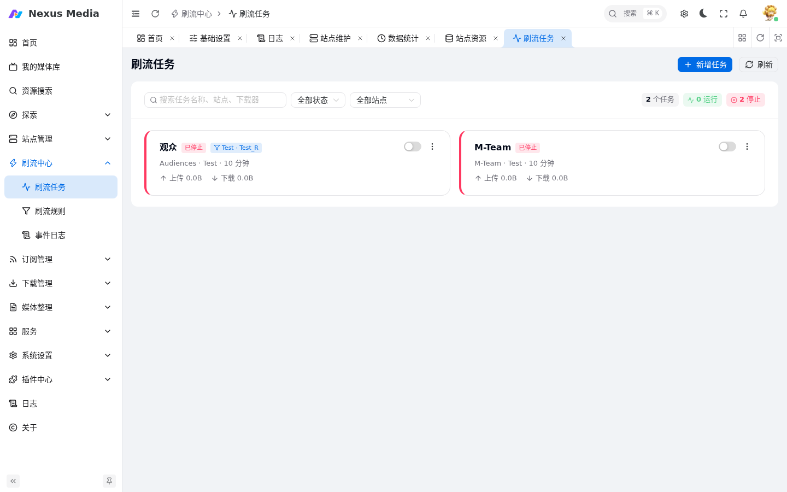{ .screenshot }

- **执行周期**：支持 5 位 Cron 表达式
- **引用规则**：选择已创建的刷流规则，任务按规则中的选种/删种/停种逻辑执行
- **促销**：选「全部」即不过滤，会下载非促销种子；免费包含 2X 免费。促销选项中没有 `FREE` 时说明暂不支持该站点刷流，请谨慎使用
- **Hit&Run**：过滤 HR，没有 HR 选项时说明暂不支持该站点刷流，请谨慎使用
- **同时下载任务数**：该任务允许下载器中同时下载的任务数（全局），需要优先保障的刷流任务可设置更大的值

!!! success "下载器版本要求"
    QB 要求 `>= 4.3.9`，TR 要求 `>= 3.0`，其它版本可能存在适配问题。

!!! warning
    「促销」选择「全部」时会下载到非 FREE 的种子，只有状态为**绿色**图标时才是只下载 FREE 种子状态。

**日常操作**：

- 点击任务的「预览」按钮查看当前管理的种子清单；手动在下载器删除的种子将在下一个同步周期后显示
- 点击「闪电图标」立即运行一次任务
- 选中任务后可批量开始/停止，未选中时默认全部任务
- 「停止下载新种状态」：不下载新种子，但已下载的种子继续维护和统计
- 刷流过程中的详细日志见 **刷流中心 → 事件日志**（`/brush/events`）

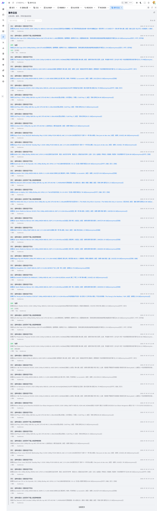{ .screenshot }

## 站点配置热更新

站点配置（各站点的解析规则、API 定义等）支持远程热更新，无需等待后端发版。

- **自动更新**：容器启动时自动检查 [nexus-media-sites](https://github.com/linyuan0213/nexus-media-sites) 仓库最新 release，发现新版本自动下载替换，失败时保留当前配置
- **手动更新**：在 **系统设置 → 基础设置** 页面顶部点击「检查更新」，有新版本时按钮高亮，更新后即时生效无需重启

**工作原理**：配置从镜像内置的 `config/sites/` 解耦，持久化在 `/config/sites/` 目录（Docker 卷挂载），`SiteEngine` 优先加载持久化目录，不存在时回退内置配置。

## 常见问题

**站点无法连通**

1. Cookie 是否有效
2. 网络连接是否正常
3. 是否配置了正确的代理

**自动签到失败**

1. 确认站点地址是否为签到页面
2. 检查 Cookie 和 UA 是否匹配
3. 验证浏览器自动化是否必要
