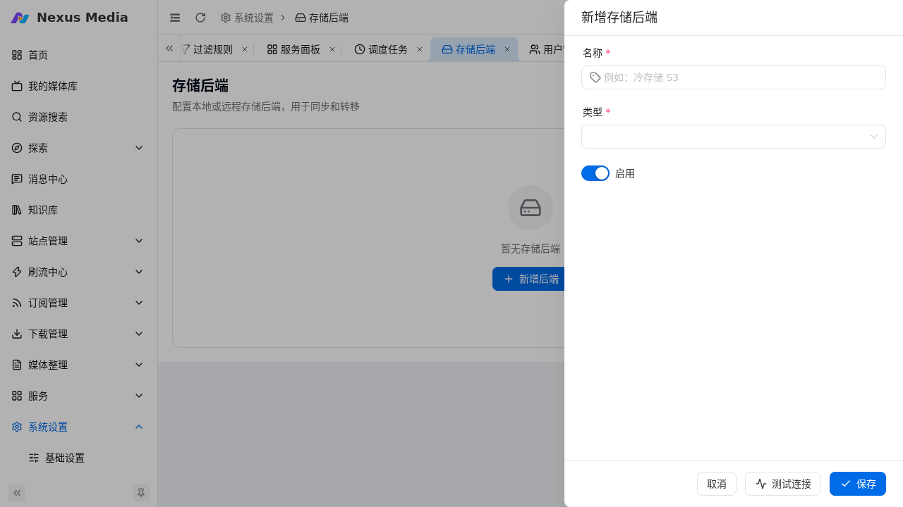

# 存储后端

入口：**系统设置 → 存储后端**（`/system/storage`）。配置本地或远程存储后端，用于**同步与转移**场景（如异地备份、跨设备媒体转移）。

{ .screenshot }

## 支持的类型

| 类型 | 说明 |
|------|------|
| 本地 | 本机目录，无需额外配置 |
| WebDAV | 通过 WebDAV 协议访问远程存储（NAS、网盘） |
| SMB | Windows 文件共享 |
| S3 | 兼容 S3 协议的对象存储（AWS、MinIO、阿里云 OSS 等） |
| Rclone | 通过 rclone remote 名称访问（需已在 rclone 中配置） |
| OpenList | OpenList 服务 |

## 新增后端

点击「新增后端」，选择类型后填写对应参数，例如 S3：

| 参数 | 说明 |
|------|------|
| Endpoint | S3 服务地址，如 `s3.amazonaws.com` |
| Bucket | 存储桶名称 |
| Region | 区域（可选） |
| Access Key / Secret Key | 访问凭证 |

!!! warning "凭证安全"
    存储凭证（Access Key / Secret Key / 密码）仅保存于本地配置，请勿截图外传。

## 使用场景

- **同步**：配合 [目录同步](directory_sync.md) 将媒体目录同步到远程存储
- **转移**：在下载器监控转移时，将文件转移/备份到远端
- 新增后端后可在对应配置中选择使用
